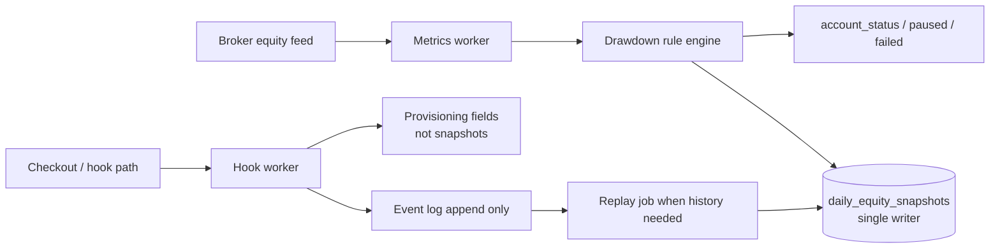

# ADR: one writer for equity snapshots

| | |
|---|---|
| **Status** | Accepted and shipped |
| **Author** | Ali Hamza Kamboh |
| **Role** | Engineer who owned the call |
| **Scope** | Live equity snapshots on funded trading accounts |
| **Systems** | Metrics worker (writer) · Hook worker (events only) · MySQL `mt_accounts.daily_equity_snapshots` · User portal Equity tab |

I write this down before the agent implements. The PR has to match it.

## Context

Funded accounts carry a JSON array of equity snapshots on each `mt_accounts` row. The portal uses that array for two things traders and support actually fight about:

1. **The violet equity line** on the performance chart (snapshot path vs closed-trade path).
2. **The Equity event audit** — forensic cards when a daily pause or drawdown breach fires (`pause_hit`, `breach_hit`), including optional frozen open positions for disputes.

Snapshots are not a cache you can rebuild casually. They are the audit trail. Wrong rows mean wrong pauses, wrong breach cards, and support tickets that cannot be closed with evidence.

## Problem

Two services both wrote the same column.

| Service | Original job | What went wrong when it also wrote snapshots |
|---|---|---|
| **Metrics worker** | Ingest live equity, run drawdown rules, update account state | Correct baseline for rule math, but raced with the other writer |
| **Hook worker** | React to account lifecycle events from the payment and provisioning path | Wrote snapshot-shaped rows on overlapping lifecycle moments |

Parallel writes looked faster on paper. In production we got:

- **Duplicate snapshot rows** for the same account and same trading moment
- **Wrong daily drawdown** on the chart (two baselines fighting)
- **False pauses** — accounts marked paused when the rule engine had not actually crossed the limit
- **Support load** — traders seeing a red breach dot or paused state that did not match their open P/L

The business number that moved the wrong way: **accounts incorrectly paused**.

## Decision

**One writer owns equity snapshots. The other emits events only.**

| Responsibility | Owner |
|---|---|
| Append / trim `daily_equity_snapshots` | **Metrics worker only** |
| Daily open rows, `pause_hit`, `breach_hit` | **Metrics worker only** |
| Account lifecycle side effects from checkout / hook path | **Hook worker** |
| Snapshot history after a lifecycle event | **Replay from the event log** — hook worker does not write the column |

Hook worker may enqueue work, update non-snapshot fields, and emit events. It does **not** parse, merge, or append the JSON array.

## Architecture

**Read path:** User portal parses the JSON array for chart + audit. No service recomputes breach cards from scratch at read time.

**Write path:** Every mutation to the array goes through one codepath in metrics (`appendEventSnapshotWithResult` and daily open tracking). No second append helper in hook worker.

## Write contract (metrics worker)

These rules are enforced in code review, not by hope:

1. **Append-only array** — never rewrite history in place except trim-from-front when over cap.
2. **Event dedupe** — at most one `pause_hit` per UTC trading day per account; breach rows carry explicit `breach_type` (`DAILY_DD` | `MAX_DD`).
3. **Retention** — daily open rows trimmed to ~90 trading days; combined array hard-capped at **200** entries (oldest dropped first).
4. **Forensic payload on events** — `equity`, `balance`, `floating_pl`, limits, optional `open_positions` (≤50 tickets) for dispute review.
5. **Deterministic before display** — rule engine decides pause/breach; the portal renders stored rows. No LLM, no client-side reinvention of breach math.

## Hook worker contract

Allowed:

- Emit structured events to the shared event log
- Update provisioning / billing / non-snapshot account fields
- Schedule replay or metrics refresh when lifecycle demands fresh history

Not allowed:

- `UPDATE mt_accounts SET daily_equity_snapshots = ...`
- Helper that merges JSON arrays locally “just this once”

If hook needs the chart to reflect a new state, it **signals** metrics or **replays** into the single writer. It does not shortcut the column.

## Event log and replay

When history must be rebuilt (late ingest, lifecycle correction, dispute re-open):

1. Read append-only events for the account
2. Metrics worker replays through the same append functions used in live ingest
3. Target: **six months of replay under 30 seconds** on the live book

Replay uses the same writer codepath as live traffic so “replay” and “production” cannot diverge silently.

## Snapshot row shapes (summary)

The column is a **TEXT JSON array**. Each element is one snapshot row.

| `type` | Meaning |
|---|---|
| *(missing)* / open | Daily trading-day open — `opening_equity` + `timestamp` |
| `pause_hit` | Safe daily DD limit hit — trading paused until UTC reset |
| `breach_hit` | Failure snapshot — `breach_type` `DAILY_DD` or `MAX_DD`; may include `from_paused: true` |

Portal chart mapping (trader-facing):

| Visual | Meaning |
|---|---|
| Teal line | Closed-trade relative P/L |
| Violet line | Snapshot equity series from stored rows |
| Amber dot | `pause_hit` |
| Red dot | `breach_hit` |

## Consequences

**Good**

- One source of truth for pause/breach audit cards
- False pause rate dropped after cutover
- Support can cite frozen `open_positions` on event rows instead of arguing from screenshots
- Replay stays testable because only one writer implements append semantics

**Cost**

- Hook path is slightly longer when it needs fresh snapshot history (event → replay instead of direct write)
- Metrics worker owns more responsibility; on-call for snapshot bugs lands there

## What we measured

| Signal | Before | After cutover |
|---|---|---|
| Duplicate snapshot rows on disputed accounts | Present on overlapping writes | None observed on spot checks |
| Accounts incorrectly paused | Primary support complaint driver | Primary driver removed |
| Replay six months | Not trusted | Under 30s target on live book |
| Chart vs rule engine disagreement | Frequent on dual-write accounts | Tied to single writer + stored event rows |

## Rollback

Do **not** re-enable dual write without a feature flag and a shadow period.

If rollback is forced:

1. Freeze snapshot appends entirely for one maintenance window (read-only portal chart)
2. Revert to previous deploy on metrics worker only
3. Backfill disputed accounts from event log through the single writer path — never hand-edit JSON in MySQL

## Revisit if

- Ingest lag exceeds **one minute** sustained
- Six-month replay exceeds **30 seconds** on the live book
- A second service asks for direct snapshot write access — answer is still no; extend the event log or add a read model, not a second writer

## Related

- [Giveaway chat platform plan](/ahkamboh/docs/plan-giveaway-chat.html) — same “one writer per aggregate” pattern on ticket state
- [ADR: token-based checkout](/ahkamboh/docs/adr-token-checkout.html) — same “one consumer owns the money path” shape
