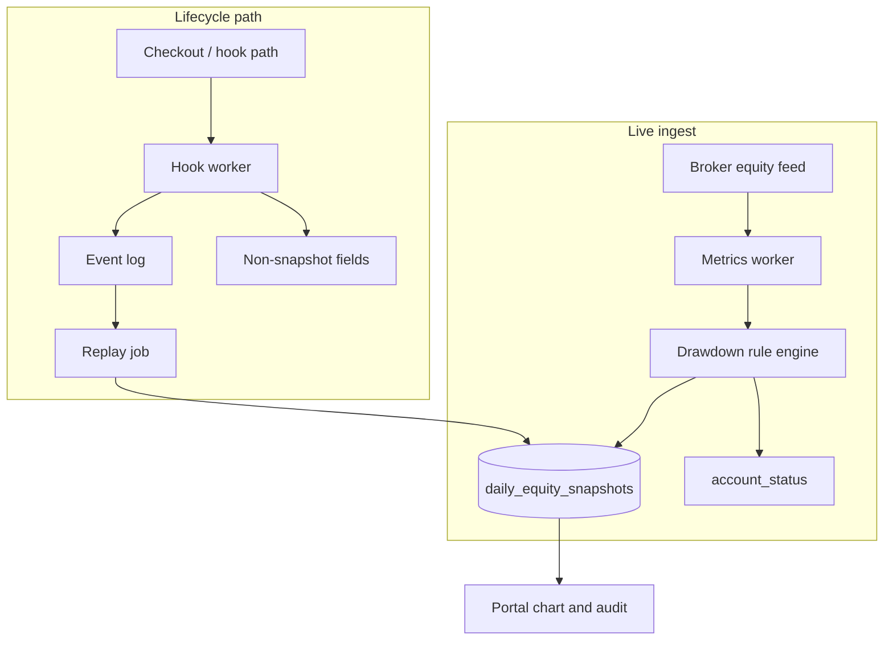

# ADR-002: One writer for equity snapshots

Accepted · Shipped

Funded trading accounts store an append-only equity snapshot history. Two services wrote the same column. We fixed it with a single writer, event-only peers, and replay from the event log.

<dl class="adr-meta">
  <dt>Author</dt>
  <dd>Ali Hamza Kamboh</dd>
  <dt>Role</dt>
  <dd>Engineer who owned the call</dd>
  <dt>Scope</dt>
  <dd>Live equity snapshots on funded accounts</dd>
  <dt>Systems</dt>
  <dd>Metrics worker (writer), hook worker (events only), MySQL <code>mt_accounts.daily_equity_snapshots</code>, user portal Equity tab</dd>
  <dt>Pattern</dt>
  <dd>Single writer per aggregate · append-only history · deterministic rules before UI</dd>
</dl>

> I write the plan before the agent implements. The PR has to match it.

## Executive summary

**Decision:** Only the metrics worker may append or trim `daily_equity_snapshots`. The hook worker emits events and updates non-snapshot fields. History rebuilds go through replay, not a second write path.

**Why it mattered:** Dual writes caused duplicate rows, wrong drawdown on the chart, and false pauses. Support volume and trader trust both moved the wrong way.

**Outcome:** One source of truth for pause and breach audit cards. Six-month replay under 30 seconds on the live book. False pauses stopped being the primary complaint driver after cutover.

---

## Context

Each funded account row carries a JSON array in `daily_equity_snapshots`. The user portal reads that array for two surfaces traders and support actually dispute:

1. **Performance chart** — the violet snapshot equity line vs the teal closed-trade line.
2. **Equity event audit** — forensic cards when a daily pause or drawdown breach fires (`pause_hit`, `breach_hit`), including optional frozen open positions for chargebacks and support tickets.

This column is not a disposable cache. It is the audit trail. Wrong rows mean wrong pauses, wrong breach markers, and tickets that cannot be closed with evidence.

## Problem statement

Two services both wrote the same column.

<table>
<thead>
<tr>
<th>Service</th>
<th>Intended job</th>
<th>Failure mode when it also wrote snapshots</th>
</tr>
</thead>
<tbody>
<tr>
<td><strong>Metrics worker</strong></td>
<td>Ingest live equity, run drawdown rules, update account state</td>
<td>Correct rule baseline, but raced the other writer on append</td>
</tr>
<tr>
<td><strong>Hook worker</strong></td>
<td>React to checkout and provisioning lifecycle events</td>
<td>Wrote snapshot-shaped rows on overlapping lifecycle moments</td>
</tr>
</tbody>
</table>

Parallel writes looked faster in design docs. In production:

- Duplicate snapshot rows for the same account and trading moment
- Wrong daily drawdown on the chart (two baselines fighting)
- **False pauses** — accounts marked paused when the rule engine had not crossed the limit
- Support load from traders seeing breach dots or paused state that did not match open P/L

**Primary metric that regressed:** accounts incorrectly paused.

## Decision

**One writer owns equity snapshots. All other services emit events only.**

<table>
<thead>
<tr>
<th>Responsibility</th>
<th>Owner</th>
</tr>
</thead>
<tbody>
<tr>
<td>Append and trim <code>daily_equity_snapshots</code></td>
<td><strong>Metrics worker only</strong></td>
</tr>
<tr>
<td>Daily open rows, <code>pause_hit</code>, <code>breach_hit</code></td>
<td><strong>Metrics worker only</strong></td>
</tr>
<tr>
<td>Checkout / provisioning side effects</td>
<td>Hook worker</td>
</tr>
<tr>
<td>Snapshot history after a lifecycle event</td>
<td>Replay from event log into the single writer</td>
</tr>
</tbody>
</table>

The hook worker may enqueue work, update provisioning fields, and append structured events. It does **not** parse, merge, or append the JSON array.

## Architecture

**Read path:** Portal parses stored rows. No service recomputes breach cards at read time.

**Write path:** Every array mutation goes through one metrics codepath (`appendEventSnapshotWithResult` and daily open tracking). No second append helper in hook worker.

## Write contract — metrics worker

Enforced in code review and tests:

1. **Append-only** — never rewrite history in place except trim-from-front when over cap.
2. **Event dedupe** — at most one `pause_hit` per UTC trading day per account; breach rows carry explicit `breach_type` (`DAILY_DD` or `MAX_DD`).
3. **Retention** — daily open rows trimmed to about 90 trading days; combined array capped at **200** entries (oldest dropped first).
4. **Forensic payload** — on events store `equity`, `balance`, `floating_pl`, limits, and optional `open_positions` (max 50 tickets) for disputes.
5. **Deterministic before display** — rule engine decides pause and breach; portal renders stored rows. No LLM. No client-side reinvention of breach math.

## Write contract — hook worker

**Allowed**

- Append structured events to the shared event log
- Update provisioning, billing, and other non-snapshot account fields
- Signal metrics or schedule replay when fresh snapshot history is required

**Not allowed**

- `UPDATE mt_accounts SET daily_equity_snapshots = ...`
- Local JSON merge helpers, even as a one-off hotfix

If the chart must reflect a new lifecycle state, hook **signals** metrics or **replays** into the single writer. It never shortcuts the column.

## Event log and replay

When history must be rebuilt (late ingest, lifecycle correction, dispute reopen):

1. Read append-only events for the account
2. Metrics worker replays through the same append functions used in live ingest
3. Target: **six months of replay in under 30 seconds** on the live book

Replay and live traffic share one writer implementation so they cannot diverge silently.

## Data model (summary)

Column type: **TEXT** holding a JSON array. Each element is one snapshot row.

<table>
<thead>
<tr>
<th><code>type</code></th>
<th>Meaning</th>
</tr>
</thead>
<tbody>
<tr>
<td><em>(missing)</em> / open</td>
<td>Daily trading-day open — <code>opening_equity</code> and <code>timestamp</code></td>
</tr>
<tr>
<td><code>pause_hit</code></td>
<td>Safe daily DD limit reached — trading paused until UTC reset</td>
</tr>
<tr>
<td><code>breach_hit</code></td>
<td>Failure snapshot — <code>breach_type</code> is <code>DAILY_DD</code> or <code>MAX_DD</code>; may include <code>from_paused: true</code></td>
</tr>
</tbody>
</table>

### Portal mapping

<table>
<thead>
<tr>
<th>UI element</th>
<th>Source row</th>
</tr>
</thead>
<tbody>
<tr>
<td>Teal line</td>
<td>Closed-trade relative P/L</td>
</tr>
<tr>
<td>Violet line</td>
<td>Snapshot equity series from stored rows</td>
</tr>
<tr>
<td>Amber marker</td>
<td><code>pause_hit</code></td>
</tr>
<tr>
<td>Red marker</td>
<td><code>breach_hit</code></td>
</tr>
</tbody>
</table>

## Consequences

<h3>Benefits</h3>
<ul>
<li>Single source of truth for pause and breach audit cards</li>
<li>False pause rate dropped after cutover</li>
<li>Support cites frozen <code>open_positions</code> instead of screenshots</li>
<li>Replay stays testable — one writer owns append semantics</li>
</ul>

<h3>Costs</h3>
<ul>
<li>Hook path longer when fresh history is needed (event → replay)</li>
<li>Metrics worker owns on-call for snapshot bugs</li>
<li>No shortcut writes during incidents — replay or wait</li>
</ul>

## Results

<table>
<thead>
<tr>
<th>Signal</th>
<th>Before</th>
<th>After cutover</th>
</tr>
</thead>
<tbody>
<tr>
<td>Duplicate rows on disputed accounts</td>
<td>Present under dual write</td>
<td>None on spot checks</td>
</tr>
<tr>
<td>Accounts incorrectly paused</td>
<td>Primary support driver</td>
<td>Driver removed</td>
</tr>
<tr>
<td>Six-month replay</td>
<td>Not trusted</td>
<td>Under 30s on live book</td>
</tr>
<tr>
<td>Chart vs rule engine mismatch</td>
<td>Frequent</td>
<td>Aligned to stored event rows</td>
</tr>
</tbody>
</table>

## Rollback plan

Do **not** re-enable dual write without a feature flag and a shadow period.

If rollback is forced:

1. Freeze snapshot appends for one maintenance window (read-only portal chart)
2. Revert metrics worker deploy only
3. Backfill disputed accounts from event log through the single writer — **never hand-edit JSON in MySQL**

## When to revisit

- Ingest lag exceeds **one minute** sustained
- Six-month replay exceeds **30 seconds** on the live book
- A second service requests direct snapshot write access — extend the event log or add a read model; do not add a second writer

## Related decisions

- [ADR: Token-based checkout](/ahkamboh/docs/adr-token-checkout.html) — one consumer owns the money path
- [Giveaway chat platform plan](/ahkamboh/docs/plan-giveaway-chat.html) — one writer per aggregate on ticket state
