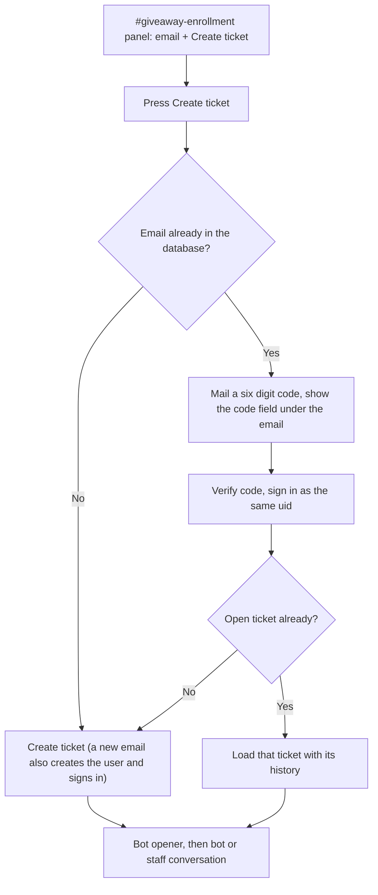
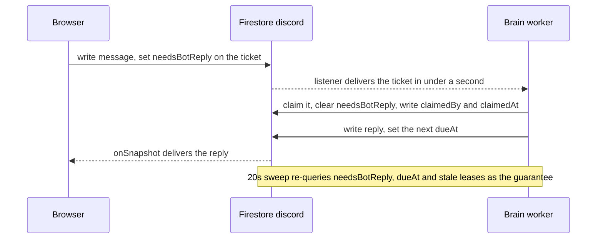

# Giveaway chat platform

Author: Ali Hamza Kamboh

Working plan as written. Firm names and brand domains are marked [Confidential].

# web-discord: giveaway chat platform

A web app that takes over the Discord giveaway funnel and replicates Discord's interface. Four channels from the paper, a ticket that is a real chat driven by the existing bot brain. Discord is switched off after cutover, so this platform owns all the data.

## Locked decisions

- Firebase Firestore, named database `discord`, project `[confidential-project]`, opened the same way [ticketfirebase.ts](admin-portal/src/lib/ticketfirebase.ts) opens `[confidential]`.
- Cloudinary cloud `[confidential]` with the existing `CHAT_CLOUDINARY_API_KEY` and `CHAT_CLOUDINARY_API_SECRET`.
- Entry is email only, asked once inside the enrollment channel. Returning login is email plus a six digit code.
- Staff are a role in this same UI, not a separate application. They sign in on an unlisted route with the same email plus code flow, land in the same Discord shell, and the `staff` custom claim decides what the sidebar shows. Access is granted from `admin-portal`.
- Login codes come from SendGrid as plain text. Envelope From remains `code@[confidential].com` or `code@[confidential].com` for domain auth and deliverability. From display name is `code`. Subject is the six-digit code alone. Body is the code, a blank line, then "Expires in 10 minutes." No [confidential], [confidential], [Confidential], or [Confidential] in subject, body, or from name.
- Code-enter auth has no daily cap on codes per address and no other member-facing limit that refuses a returning member a code. Kept only: 60 second resend cooldown, five wrong guesses then lockout on that code, IP-level verify-failure ceiling.
- Duplication is giveaway chance, not auth. Hard once-only forever is email-only: after a completed entry writes `entrants/{brand}_email_{hash}`, a later ticket or retry for that same email shows `MSG_ALREADY_GOT_CHANCE` ("you already got chance"), including days later. Reviewer name and screenshot phash are not hard already-got-chance gates (they can collide across cases, and vision can miss or mis-analyze them), so they must not show that message and must not refuse a new entry by themselves. No auth signup cap (no "max registered users" rule). First-press instant signup for a brand-new email stays locked with no verification friction.
- One chance per email, once only, and it still holds days or weeks later because the email `entrants` document never expires. The only hard, completion-gated already-got-chance key is email: chose email-only over email+device as a hard refuse. Shared phones and family devices would false-block honest users, which the owner banned; a second email on a new identity is an accepted residual risk. Review name, screenshot phash, device, browser marker, and ipHash may remain as soft signals for staff or logs only, and never drive `MSG_ALREADY_GOT_CHANCE` or refuse entry alone. IP is never a sole hard block for a new email. A first-timer on a new email never sees `MSG_ALREADY_GOT_CHANCE`. Details are in the one chance per person section.
- The interface copies Discord's look, not its furniture: channel sidebar, channel header, grouped message list with day dividers, composer, embed card. Nothing else on a member's screen, and one staff exception, per the four surfaces section below.
- More than 80% of the traffic arrives on a phone, so the mobile layout is a build requirement on every surface and not a pass at the end. The message rows are our own Tailwind components over `@tanstack/react-virtual`, pinned at 3.14.9, in end-anchored mode, with no chat UI kit and no hosted chat SaaS anywhere in the stack. Both decisions are argued in the UI and mobile sections below.
- One platform, subdomain decides the brand, one brain. Served from `chat.[confidential].com` for [Confidential] and `chat.[confidential].com` for [Confidential], with [Confidential] launching first on its own.
- Discord retires after cutover.

## The four channels

- `#giveaways`: staff post giveaway text, read only.
- `#giveaway-winners`: winner list, read only.
- `#giveaway-enrollment`: the Ticket Tool panel, rebuilt pixel for pixel. A staff line above it ("To proceed further, please open a ticket so our team can assist you properly."), then the embed card with the green left bar, the title, the line "To create a ticket use the Create ticket button", the small footer row, and the Create ticket button underneath. The one addition is an email field, because on Discord the member was already known and on the web nobody is.
- `#ticket-0001`: private to its owner, listed under Opened Tickets, bot posts the opener, then the guide image, then the user uploads the Trustpilot screenshot. The opener carries the brand name in bold and no review URL at all, which is the frozen bot's behaviour and an explicit owner decision. The guide image is what points the member at Trustpilot. Where the review URL does live is under subdomain decides the brand, below.

### What happens when Create ticket is pressed

The button behaves like Discord's the moment we know who the person is. The email field exists only to establish that.

- **New email.** The user doc is created, a custom token signs the browser in, and the ticket is created in the same press. The channel appears in the sidebar and the bot posts the opener. One click, exactly like Discord.
- **Email we already have.** Nothing is created. The server confirms the email exists, mails a six digit code, and a code field appears directly under the email field in the same panel. Once the code verifies, the browser signs in as that same uid and their ticket loads from the database with its full history.
- **One open ticket per person.** While a ticket is open, the button always returns to it instead of making another, enforced in the server route and in the rules rather than in React, since the current portals do this check in the component where it can be bypassed. The enforcement is a read-modify-write on `users/{uid}.openTicketId` inside the create transaction, not a check followed by a create: a double tap on a slow phone, or two tabs pressing at once, both read "no open ticket" and both create one if the decision is not inside the transaction that writes it. If the person's ticket has been closed, a fresh one is created; if that same email already completed an entry, the bot's email `entrants` check replies with `MSG_ALREADY_GOT_CHANCE` and blocks a second giveaway chance. That is chance dedupe on email only, not an auth cap, and not a review-name or screenshot refuse.
- **One chance per email, decided before anything is created.** The create path checks the completion-gated email entrant first. A hit answers `MSG_ALREADY_GOT_CHANCE` and creates no ticket. A miss creates the ticket as normal, which is what keeps a first-timer on a new email at one click. Review name, screenshot phash, browser marker, and device fingerprint do not refuse create by themselves and do not show that message. A matching IP on its own never refuses anybody.
- **The create transaction sets the work flag.** It writes `needsBotReply: true` on the new ticket in the same commit, which is what the brain's listener matches on. Creating the ticket and expecting the brain to notice it some other way is how a ticket sits silent forever: nothing else in the design polls for new tickets, so a created ticket with no work flag and no `dueAt` is invisible to all three mechanisms. The ticket number is not allocated here, for the reasons in the write-limits section, so the sidebar shows a creating row for the moment before `#ticket-NNNN` appears.
- **The create transaction writes `approval: 'none'`.** The field is always present so the review-queue equality filter can match later. It becomes `pending` only when a screenshot is attached, which is when there is something for staff to decide. Creating as `pending` was rejected because every ticket without a screenshot would sit in the review queue from the moment it was created, which makes the queue useless for triage. Narrowing the query with a second equality was rejected because it costs an extra indexed field to express something the state machine can express for free.

After the ticket exists, the conversation runs the same way it does on Discord: the bot handles it, and staff can take over at any point.



## What we copy from the live ticket system

The four deep dives confirmed the [Confidential] and [Confidential] chat is worth reusing almost pattern for pattern.

- Path shape `chats/{uid}/tickets/{ticketId}/messages/{msgId}`. Ownership sits in the path, so the security rule is one line and per-user data shards naturally.
- Denormalized `recentActivity` on the ticket doc ([adminTicketFirebase.ts](admin-portal/src/lib/adminTicketFirebase.ts) lines 464 to 471, declared at lines 64 to 65), as the single sort key for every inbox query. The live code also denormalizes `lastMessage` so an inbox can render a preview without message reads. v1 drops `lastMessage`: nothing reads it (the member sidebar and the staff inbox are channel lists with no preview row, and the review queue shows email, number and age), and an unread field members can write is a spoofing surface for the day someone renders it as a preview. If a preview is built later, the field is added back deliberately with that question answered, and writing it costs nothing extra then because the batch already writes `recentActivity`. The `unreadCount` and `adminUnreadCount` increments that sit at lines 474 to 482 of that same function are not copied, and no read-marker field replaces them, because v1 has no unread markers at all apart from the staff Needs a human count.
- `recentActivity` as the single sort key for the whole inbox.
- Live listener on the newest 20 messages descending with `limit`, older history paged with `startAfter`, and the `hasPendingWrites` guard so an optimistic bubble is not clobbered by a null server timestamp ([ticketFirebase.ts](user-portal/src/lib/ticketFirebase.ts) lines 348 to 366).
- The principle behind the automation contract, though not its plumbing: the worker never trusts a payload, it re-reads Firestore and decides from stored state. See `notifyAdminReply`, `/api/tickets/notify`, `enqueueTicketEvent` and `hook-worker/src/workers/ticket-autoresponder-worker.ts`. The ping and the BullMQ job themselves are dropped, because a resident worker watching Firestore needs neither, and the sweep covers what the ping was insuring against.
- A per-ticket automation kill switch (`autoCloseDisabled`), which becomes our `botMuted` flag for staff takeover.
- Assignment on first reply rather than on open, with an append-only assignment history as a staff-side code convention. Rules cannot cheaply compare array prefixes, so append-only is not a rules guarantee.
- Notification gating: relevance filter, suppress the thread already on screen, suppress blocked users, throttle to one alert per second.
- Signed server-side image upload that forces webp and strips metadata.
- Stats bucketing from the discord-tickets route: buckets generated in JS so empty days render as zero, explicit Asia/Karachi offset over UTC storage, day, week and custom ranges, missing data degrading to zero. Only the bucket generation carries over, since the SQL merge underneath it has no Firestore equivalent.

## What we fix instead of inheriting

These are real defects in the current code, and building fresh is the moment to not repeat them.

- No Firebase Auth anywhere today. Identity is a string read out of `localStorage` and interpolated into the Firestore path, so `request.auth` is always null and no rule can express ownership. We mint a Firebase custom token at login so rules have a uid.
- No `firestore.rules`, no `firestore.indexes.json`, no App Check in any repo. We commit rules and indexes before the first UI commit.
- The unbounded `collectionGroup(db, 'tickets')` listener with no where, no limit, mounted on every user's ticket page ([ticketFirebase.ts](user-portal/src/lib/ticketFirebase.ts) line 520). Every browser streams every ticket in the database. This plus the admin listener that rebuilds one subscription per chat doc on every change is what drives the 13M weekly reads. We never open an unfiltered collection group listener, and every staff query is bounded and brand-scoped.
- No idempotency on send. We generate the doc id client side and write with `setDoc` plus a `clientMsgId`, so a retry is a no-op instead of a duplicate.
- `addDoc` then a separate `updateDoc` is non-atomic and can leave a message with stale counters. We use `writeBatch`.
- `markTicketMessagesAsRead` runs a query plus a batch write plus a doc update on every inbound snapshot. We write nothing at all on read, because v1 renders no unread state to write it for.
- Unsigned browser-to-Cloudinary uploads with the preset name in the bundle, and upload routes with no auth at all. Ours are signed and session gated.
- Secrets in `NEXT_PUBLIC_` (`NEXT_PUBLIC_API_SECRET_KEY` shipped to the browser in `DiscordTickets.tsx`). Ours stay server side.
- `dangerouslySetInnerHTML` on message bodies with no sanitizer. Ours render through a markdown renderer with raw HTML disabled and a link-protocol allowlist of `https` and `mailto`, and `dangerouslySetInnerHTML` appears nowhere in the codebase. On top of that the app sends a Content-Security-Policy with `script-src 'self'`, `img-src 'self'` plus the Cloudinary delivery host, no inline script and no `unsafe-inline`. The session that renders the most member-authored text is a staff session holding the claim, so a script that executes there reads every ticket in the brand.
- Single client components of 4,700 and 5,500 lines. We build a server shell with small client islands, split along the routing boundary described below: the layout owns the sidebar and its listener, each channel pane owns only its own.

## Firestore model (database `discord`)

- `users/{uid}`: brand, email, createdAt, and `openTicketId` as the one-open-ticket pointer. No `displayName` and no `lastSeenAt` on a member document, because nothing in v1 renders either: the sidebar footer shows the signed-in email and a member is never named to anybody else. Normalisation is defined once in `packages/shared` and used by every path that hashes an address: trim, then lowercase, and nothing further. Plus-addressed and dot-aliased forms of one Gmail address therefore hash to different uids, so one person can hold several member identities under different addresses; hard already-got-chance still keys only on the email used for that completed entry, and no verification friction is added to the member flow to close alias gaps. A member uid is derived deterministically as a hash of brand plus normalised email, so "is this email already known" is a get by document id rather than a `where email ==` query, and the code login on a new device lands on the same uid without a lookup. The custom token is minted for that same uid. `createdAt` replaces `discord_member_joins` for the joins metric. Staff are the exception: a staff uid is a hash of a `staff:` prefix plus the normalised email with no brand in it, and the document carries `staff: true`, a `brands` array, a `displayName`, `grantedBy` with `grantedAt`, and `firstSignInAt`, because one person works both brands and a brand-scoped hash would give them two identities for one job. `displayName` exists only here, since the staff side is the only place a name is rendered, and `firstSignInAt` is what makes a grant to an address nobody owns visible in the portal.
- `brands/{brand}/posts/{postId}`: kind giveaway or winner, title, body, image as secure_url, public_id, width and height, authorId, createdAt. Feeds the two read-only channels, bounded per brand.
- `chats/{uid}/tickets/{ticketId}`: brand, number (absent until the brain allocates it), status awaiting_review / awaiting_email / completed / escalated / closed, approval (`none` at creation, `pending` once a screenshot is attached, then `approved` or `rejected`), email, the `screenshot` and `vision` maps pinned below, introSent, trustpilotSent, deferredByCap, followupSent, customerReplied, botMuted, assignedTo with an append-only history by staff-side convention (not a rules guarantee), approvedBy and approvedAt for the human screenshot decision, alertSentAt so a redeploy cannot re-alert an open escalation, needsStaff with memberWaitingSince and waitingAlertSentAt for the tickets a human owes an answer, visionAttempts as the retry bound, messageCount and userMessageCount, recentActivity, createdAt, completedAt, closedAt, plus the four fields the brain runs on: needsBotReply, dueAt with dueAction, and claimedBy with claimedAt for the lease. No `lastMessage` in v1, per the pin below. No read-marker fields, per the fix above. `assignedTo` and `approvedBy` hold staff uids and never an address or a name. `botMuted` stands in for the bot's `staffPaused` and the `escalated` status for its `escalated` flag, which is what keeps the follow-up guards portable. Same fields as `ticket_giveaway_submissions` so the brain logic ports directly, and `completedAt` is carried explicitly because the funnel chart depends on it.
- `chats/{uid}/tickets/{ticketId}/messages/{msgId}`: sender user / bot / staff, authorId plus a brand persona authorLabel on staff messages and never a staff name or work address, since the member can read every field in their own path, systemType for bot generated notices, body, media array with secure_url, public_id, width and height, createdAt, clientMsgId, and `brand`. The `brand` field is denormalized onto every message for the staff read rule, which is the next paragraph. Messages are create-only for members: no update and no delete, so the text and the screenshot a decision was made on cannot be edited afterwards.
- `login_codes/{brand}_{emailHash}` for members and `login_codes/staff_{emailHash}` for staff, with `purpose` naming which: codeHash, expiresAt, attempts, lastSentAt, lockedUntil, uid. No `sentToday` and no daily codes-per-address counter. Server only, deleted on a successful verify. One implementation serves both doors, and a third `purpose: 'grant'` serves the code the granting admin completes in the staff role section. A Firestore TTL policy on `expiresAt` clears abandoned documents, so an unverified code is deleted rather than left sitting in the collection.
- `rate_limits/{scope}_{keyHash}_{window}`: `count` and `windowStartedAt`, a fixed-window counter incremented in the same transaction as the verify it guards. Scope is `ip` for the verify-failure ceiling; the key is hashed. Server only. This is what replaces the Redis counter the design removed. It is not a daily code-send cap and must not refuse a returning member a fresh code beyond the 60 second resend cooldown.
- `counters/{brand}_daily_{YYYYMMDD}`: acceptCount, incremented in a transaction, which is the 15 and 8 daily cap. The day key is a UTC date, matching `utcDateKey` in [ticketTrustpilotCap.js](telegram-bot/ticketTrustpilotCap.js). The funnel buckets under `stats` use Asia/Karachi instead. Two calendars in one product is deliberate and both are named here, because unifying them later would move the cap boundary by five hours and change who wins on a given day.
- `counters/{brand}_ticket_seq`: the last allocated ticket number, incremented in a transaction. This replaces MySQL auto increment for `ticket-3018` style names. The brain is its only writer, which is what takes it off the create path; the write-limits section below is where that is argued.
- `entrants/{brand}_email_{hash}`: the only hard already-got-chance key. Deterministic document id, so a duplicate check is a get by id rather than a query. The document carries `uid`, `ticketId` and `createdAt`, so a duplicate check can exempt the caller's own ticket and a crash-and-retry cannot make a legitimate winner block themselves. Written at completion and not at ticket creation, so somebody who opened a ticket, never finished, and comes back a week later is not blocked by their own abandoned attempt. After that completed entry exists, a later ticket or retry for the same email shows `MSG_ALREADY_GOT_CHANCE` ("you already got chance"), including days later. This is giveaway-chance dedupe on email only, not an auth signup cap.
- `entrants/{brand}_review_{hash}` and `{brand}_shot_{hash}`: optional soft records only, written at completion if useful for staff, logs, or vision internals. Review hash is the lowercased trimmed reviewer name; shot hash is the perceptual hash Cloudinary returns at upload. They must never show `MSG_ALREADY_GOT_CHANCE` and must never refuse a new entry by themselves, because reviewer names and screenshots can collide across cases and vision can miss or mis-analyze them.
- `entrants/{brand}_device_{hash}`: optional secondary soft signal only, if kept. Never a sole refuse and never the driver of `MSG_ALREADY_GOT_CHANCE`. If written, it is completion-gated and may carry `emailHash` plus an optional `ipHash` for staff review. IP is never a document id and never a sole hard block.
- `stats/{brand}_{YYYYMMDD}/shards/{0..9}`: signups, ticketsCreated, completed, incremented on a random shard and summed on read. Firestore has no GROUP BY, so the funnel chart reads ten small documents per day rather than scanning tickets, and the shards keep a launch-day signup burst under the per-document write limit.
- `ticket_index/{brand}_{number}`: uid, ticketId, brand, number, written in the same transaction that allocates the number. It exists so staff can open a ticket they do not own without the banned collection group query by ticket number. No client reads it either: the lookup goes through a server route on the Admin SDK that checks the staff claim and that the document's `brand` is in the caller's `brands`. Ticket numbers are sequential, so a client-readable index is a corpus somebody can walk from 1 upward to collect every ticket number, owner uid and ticket id in the brand. One read per lookup at staff volume is nothing, and a server route is revocable the moment a session is revoked rather than an ID token later.
- `staff_audit/{autoId}`: action grant or revoke, actor, target, targetUid, brands, `actorCodeVerified` (true only when the acting admin completed a `purpose: 'grant'` code for that action; grant requires the code, revoke does not, so revoke rows record false), createdAt. Append only and server only, written before a claim is applied.

Rules: posts readable by anyone and written by no client at all, since a post has to revalidate the feed cache tag in the same server action that writes it. `users/{uid}` is readable by its own uid and with the staff claim, written by no client: the own-uid read is what lets a live session watch the mirrored staff flag, and the claim read is how the staff side resolves a display name from a staff uid. `chats/{uid}/**` is readable when `request.auth.uid == uid`, or when `request.auth.token.staff == true` and the document's own `brand` field is in `request.auth.token.brands`. Every document under that path carries `brand` for exactly that reason: the staff rule tests a field on the document in hand and never calls `get()` on the parent ticket, because a `get()` in a rule is billed like a read and a request that pages twenty messages would also run into the per-request lookup ceiling. Member reads stay by path ownership, so the denormalized `brand` is only ever consulted on the staff branch. Counters, stats, `entrants`, `login_codes`, `rate_limits`, `ticket_index` and `staff_audit` are server only, read and write.

Writes on a ticket are an allowlist, not a denylist. A denylist is correct only until somebody adds a field and forgets to name it, and this document adds fields in almost every section below. The owner may write three things: `needsBotReply` set to `true` and never to `false`, which belongs to the claim transaction; `recentActivity`; and their own message counters, `messageCount` and `userMessageCount`. The rule is the affirmative form, `request.resource.data.diff(resource.data).affectedKeys()` must be a subset of that set, so every field not on it is refused without being listed: `brand`, `botMuted`, `status`, `approval`, `dueAt` and `dueAction`, `claimedBy` and `claimedAt`, `approvedBy` and `approvedAt`, `completedAt`, `closedAt`, `assignedTo`, `needsStaff`, `memberWaitingSince`, `waitingAlertSentAt`, `alertSentAt`, `visionAttempts`, `number`, `email`, and the `screenshot` and `vision` maps. This is also the root fix for two of the brain's failure modes rather than a separate defence: a member who cannot clear a work flag cannot orphan their own ticket, and a member who cannot write `dueAt` cannot make the sweep spin on a deadline that never clears.

Messages are create-only for members. No update and no delete, so the evidence a decision rests on cannot be altered after the decision. `sender: 'user'` is accepted only from the owner of the path, `sender: 'staff'` only with the claim and with `authorId == request.auth.uid`, and `sender: 'bot'` from no client at all. The sender field is checked on write rather than taken as the client's word about itself. The create is allowlisted by field as well: a member message may carry `sender`, `authorId`, `body`, `media`, `createdAt`, `clientMsgId` and `brand`, and nothing else, so `systemType` and `authorLabel` are refused. A member who could write `systemType` could forge a system notice, and one who could write `authorLabel` could post as the brand persona in their own ticket. A `completed` or `closed` ticket refuses a member message create outright, which is what makes read only real instead of a disabled button.

Staff may write `botMuted`, `status`, `approval` constrained to `pending`, `approved` or `rejected` (never `none`, for the reasons pinned under `approval` below), `approvedBy` which must be set to `request.auth.uid` on every write that changes `approval` (including a re-queue to `pending`) so a decision cannot be attributed to a colleague by writing their uid or by leaving theirs in place, `approvedAt`, `assignedTo` with the `assignedToHistory` entry appended beside it (append-only is a staff-side convention; rules do not enforce array-prefix append-only), `needsStaff` with its two waiting fields, and `needsBotReply`, plus the denormalized `recentActivity` their message batch bumps, and may clear `dueAt` but never set one, since takeover clears the work fields and hand back sets `needsBotReply` alone, leaving the brain to schedule its own `dueAt`; the lease is refused, it belongs to the brain. Status transitions are guarded as far as a rule can express them: `completed` and `closed` are terminal for every client, so no client write moves a ticket out of either. That is the rule form of the guard `applyStaffTakeover` already enforces in code, and it is worth having in both places, because a settled entry that regresses into the live funnel can be paid twice. The brain and all server routes go through firebase-admin, which bypasses rules. Why staff read through a bounded client listener under this clause rather than through server routes is argued in the staff role section.

Staff access is a Firebase custom claim, `staff: true` plus a `brands` array, granted from a screen in `admin-portal` rather than a CLI script, with the same flag mirrored on the user document. There is no self-service path to it. The claim only takes effect after the target's ID token refreshes, which is what the mirrored flag is used to force, and the portal's own weak authentication makes it the root of trust for this platform. Both of those are dealt with in the staff role section.

Indexes: collection group `tickets` on brand plus recentActivity descending for the staff sidebar, brand plus `needsStaff` plus recentActivity ascending for the Needs a human group (oldest first, argued in the staff sidebar section), brand plus approval plus createdAt descending for the review queue, and the three the brain relies on, `needsBotReply`, `dueAt` and `claimedAt`. All three of the brain's are single-field but must still be declared, because automatic single-field indexing is collection scoped and a collection group query needs collection group scope. Miss that and the brain's very first query fails at startup. `claimedAt` is the one a straight reading of the design would leave out, since it exists only for the stale-lease sweep described under the brain, and leaving it out breaks exactly the query that recovers a ticket nothing else can see. One collection-scope composite as well: `posts` on kind plus createdAt descending, because each feed reads one kind ordered by time, and an equality plus an orderBy on a different field needs a composite even inside a single collection. The review-queue index also serves the day, week and month rating tallies, which filter brand and a decided approval and range on createdAt. Everything else resolves by document id or rides the automatic single-field indexes.

### The screenshot and the vision verdict, by field name

"Screenshot fields" and "the vision verdict" are placeholders everywhere above, and they are the one gap that has to be closed before any parallel work starts: the review queue tallies stars, completion may store soft review-name and screenshot hashes for staff or logs (never hard already-got-chance), the completion copy quotes the reviewer name back to the member, and `packages/shared` is the single coupling point all three read from. The names below come from the frozen bot's own output in [ticketVision.js](telegram-bot/ticketVision.js) and its `dbUpdateScreenshot` columns, so the port stays a transcription, and they live in `packages/shared` as one type imported by `apps/web` and `apps/brain`.

`screenshot` on the ticket document, and the same shape inside a message's `media` array so a feed image and a ticket image are stored identically:

- `secure_url`, `public_id`, `resource_type`, `format`, `bytes`, `width`, `height`: the Cloudinary response kept whole, for the deletion reason in the Cloudinary section. `width` and `height` are also what the message row reserves its box from.
- `phash`, with `etag` as the fallback when a perceptual hash is not returned. Stored for vision and soft staff or log signals; it is not a hard already-got-chance gate, and it is why the brain never needs the bytes.
- `uploadedAt`.

`vision` on the ticket document, written by the brain and by nothing else:

- `reviewerName`: the name on the review card, trimmed. Used in completion copy and as an optional soft staff or log signal; lowercased it may key a soft `entrants/{brand}_review_{hash}` record, matching the bot's `LOWER(TRIM(review_name))` today, but it never hard-blocks already-got-chance.
- `title`: the review title, trimmed. The bot's `review_title` column.
- `stars`: an integer 0 to 5, clamped and rounded the way `parseVisionResult` does it. Zero is not "no rating", it means the rating could not be read off an otherwise verified card, and it is a case the daily cap still counts.
- `decision`: `accept`, `reject` or `unclear`. `accept` is the bot's `isSubmittedReview` with a company that matches the brand, `reject` carries a reason, and `unclear` is the state a retry can still resolve.
- `reason`: `draft`, `wrong_company`, `trustindex`, `too_large` or null. The same set `rejectReason` already uses, so the `MSG_*` mapping ports with no translation table.
- `company`, `reviewDate`, `platform`: extracted and stored for audit. None of them rejects on its own, and `reviewDate` never gates anything, matching `applyTicketDateGate`.
- `model`, `decidedAt`, `attempt`: which model answered, when, and which rung of the retry ladder it came back on.

`vision.stars` and `approval` stay separate fields on purpose. One is what the model read off the screenshot and the other is what a staff member decided about it, and collapsing them would lose the disagreement that the review queue exists to show.

### The ten names this section described in prose

`packages/shared` cannot ship a type for a field the plan only describes, so these ten are pinned here and the package matches them exactly. Three of them are closed unions, and closing one late is worse than closing it now: a stored value that a running worker does not recognise arrives during the few seconds a DigitalOcean deploy runs the old build and the new one together.

- **`assignedToHistory`**, an array of `{ staffUid, assignedAt }`, named after the field whose changes it records. The portal's version is `managerHistory`, and its entries also carry a `managerName` and a remark `status`; neither crosses over, since a name on this document is a name the member can read and the remark workflow does not exist here. Append-only is a staff-side code convention: rules cannot cheaply compare array prefixes, so they do not guarantee it. `assignedAt` is an ISO-8601 string the writer computes, not a server timestamp, because Firestore refuses a sentinel nested inside an array, which is exactly why the portal stored an ISO string. The server-side time for that moment is already on the document, since the same batch writes `recentActivity`. This field has to appear on the staff write allowlist beside `assignedTo` or the takeover batch is refused for touching a field nothing named.
- **`counters/{brand}_ticket_seq.lastNumber`**, the last number handed out. It holds the last allocated value rather than the next free one, so a missing document reads as zero and the first ticket is number one.
- **`staff_audit.actorCodeVerified`**, whether the acting admin completed a `purpose: 'grant'` code for that action. Grant requires the code; revoke does not, so revoke rows record false. It is a property of the row and not of the person, and it is written on every row rather than only when true, so the trail can still answer the question for every action.
- **`dueAction` is `guide_image`, `followup`, `cap_resume` or `staff_waiting_alert`.** Three are the frozen bot's own timed steps: `WRITE_REVIEW_GUIDE_DELAY_MS` is the 1.5 second gap before the guide image, `FOLLOWUP_MS` the 10 minute follow-up, and `resumeDeferredTrustpilotAsks()` releases an ask a full cap withheld at the next UTC midnight, which is `cap_resume`. `staff_waiting_alert` is new to this platform and is the one action that runs on a muted ticket. The opener is not on the list: it rides `needsBotReply` from the create transaction, and the bot's 1.5 second opener delay is a sleep inside the request with no state worth preserving. Nothing else in the frozen bot waits on a clock; its other periodic work is the reconcile sweep, which this design already has, plus a Discord channel prune with no equivalent here.
- **`systemType` is `ticket_created` or `ticket_closed`**, both written through firebase-admin only, the first by the create transaction and the second by the member Close route. No client writes the field, staff included, since one who could set it could forge a system notice. `ticket_created` is the welcome row the embed card and its Close button hang off, so the renderer reads it as data instead of matching on body text. `ticket_closed` is the only other state change a member sees that no copy announces: completion already says so in `MSG_THANK_YOU_SALUTE`, and takeover is invisible to the member by design, so neither gets a notice and the union stays at two.
- **`purpose: 'member'`** is the third value beside `staff` and `grant`.
- **`login_codes/grant_{emailHash}`** is the grant code document, brand-independent for the same reason the staff code is. Since a member code id starts with a brand key, no brand key may ever be named `staff` or `grant`.
- **`{window}` in a `rate_limits` id is the start of the window in epoch milliseconds**, floored to the window length. Every caller inside one window derives the same id with no read, and an expired window becomes a new document rather than a counter somebody has to reset, so there is no reset path to get wrong. Keying on the time the window's first request arrived is not derivable by the second caller, so two parallel verifies would write two documents and each would see half the failures. The window length sits beside the id builder in `packages/shared`, so the id and the check it guards cannot disagree.
- **`approval` is written at creation with the value `none`.** Attaching a screenshot is the transition to `pending`, which is when there is something for staff to decide. The decided values stay `approved` and `rejected`. The field is always present: the review queue filters `where approval == 'pending'`, and a Firestore equality filter cannot match a missing field, so the brand plus approval plus createdAt index is unchanged and needs no fourth field. Creating as `pending` was rejected because every ticket would enter the queue before a screenshot arrived, which makes the queue useless for triage. Narrowing the query with a second equality was rejected because it costs an extra indexed field to express something the state machine can express for free. `TicketApproval` in `packages/shared/src/types.ts` is the four-value union `'none' | 'pending' | 'approved' | 'rejected'`. The deployed `firestore.rules` constrain client writes of `approval` to only `'pending'`, `'approved'` and `'rejected'`, with `'none'` left out on purpose. That mismatch between the type and the rules is intentional and must not be "fixed" by pasting the union into the ruleset. The clause is only reachable on a staff update: client creates of a ticket are refused by `allow create: if false`, and `approval` is not on the member write allowlist at all, so the only caller subject to it is a staff session changing an existing ticket. Nothing subject to rules ever writes `'none'`; ticket creation runs through firebase-admin, which bypasses rules, and that transaction is what writes `'none'`. Staff must not be able to reach `'none'` from any state, because it means no screenshot yet: writing it onto a ticket that has one erases the record that the screenshot arrived, and because `#review-queue` filters on `approval == 'pending'`, it would drop a ticket that is owed a decision from the queue without any decision being made. That is exactly the state the four-value lifecycle was introduced to distinguish. Refusing the value is the transition constraint, and it is cleaner than a from/to matrix, because staff cannot reach `'none'` from anywhere so there is no ordering left to reason about. Staff may still write `'pending'`, which is how a decided ticket gets re-queued for another look. The forward move from `'none'` to `'pending'` when a screenshot attaches is a server write, so it does not depend on this clause. The rules value list is labelled as the set staff may write, not a copy of `TicketApproval`; if a fifth approval value is ever added, the correct move is to reason about whether staff may write it, not to paste the union in. Any client write that changes `approval` must also set `approvedBy` to the caller's own uid, including a re-queue to `'pending'`. Refusing only a write of a colleague's uid still left false attribution reachable by omission: a second reviewer could overturn a verdict, touch nothing else, and leave a colleague's name on the decision.
- **`status/brain`** carries `sweptAt`, `instanceId`, and one count per sweep query: `needsBotReplyCount`, `dueAtCount` and `staleLeaseCount`. Each is named after the query that produced it. A count that stays high across passes is work arriving faster than it is answered, which `sweptAt` on its own cannot show. The document needs no rule, because everything the ruleset does not name is refused.

v1 also drops `lastMessage` from the ticket model. Nothing in v1 reads it: the member sidebar and the staff inbox are channel lists with no preview row, and the review queue shows email, number and age. An unread field members can write is a spoofing surface waiting for the day someone renders it in a preview, since a member could write text that reads like a staff reply. If a preview is built later, the field is added back deliberately with that question answered, and writing it costs nothing extra then because the batch already writes `recentActivity`.

### Rules and indexes are managed from the repo

Both live as files and deploy from the command line, so they are reviewable and repeatable instead of clicked into the console. Firestore applies them per named database, so `firebase.json` names the target explicitly:

```json
{
  "firestore": [
    {
      "database": "discord",
      "rules": "firestore.rules",
      "indexes": "firestore.indexes.json"
    }
  ]
}
```

Deploy with `npx firebase-tools deploy --only firestore --project [confidential-project]`. Naming the database is a safety requirement, not a style choice: `[confidential]`, `[confidential]`, `[confidential]` and `fxquot` have no rules in version control, so a default single-database config could overwrite a live brand's ruleset. Only `discord` is ever targeted.

Single-field indexes are automatic. Composite and collection-group indexes are declared in the file. A rules deploy replaces the live ruleset for `discord`; removing an index that exists live but is absent from the file is a separate confirm step, so nothing disappears silently.

Status of the tooling: `firebase-tools` 15.26.0 is installed and logged in as `cursorahbytes@gmail.com`, which has access to `[confidential-project]`. The `discord` database exists as Standard edition, Firestore Native, in `asia-southeast1`, recreated there on 10 August with no data, no composite indexes and no field overrides. It ships with default closed rules that block all client traffic, so the first rules deploy is what makes the app work at all.

The brain's credentials already exist, so no key needs generating. `FIREBASE_SERVICE_ACCOUNT_JSON` in `graph-servers/hook-worker/.env` is a `service_account` for project `[confidential-project]`, identity `firebase-adminsdk-fbsvc@[confidential-project].iam.gserviceaccount.com`. Verified on 10 August by writing, reading, listing and deleting a probe document in `discord` with firebase-admin: full access, and the probe was removed so the database is still empty.

Firestore admin permissions are project-scoped, not per database, which is why this works. The hook-worker is the precedent: identical credentials with `FIREBASE_FIRESTORE_DATABASE_ID=[confidential]`. The brain reuses the same JSON and sets the database id to `discord`, so its configuration mirrors a setup already running in production. Admin bypasses security rules, so the default closed ruleset on `discord` does not block the brain even before the first rules deploy.

Where that key lives matters more than where it came from. It is a DigitalOcean app-level secret on the worker component and it is never committed, which is a deliberate exception to the habit in these repos of committing `.env` files: a service account JSON in git is every ticket in every brand database, readable by anybody who ever clones the repo or reads a stale branch. The same project scope that makes the reuse convenient is the blast radius, since one key reaches `[confidential]`, `[confidential]`, `[confidential]` and `fxquot` as well as `discord`. That is accepted for phase one because it is the key already in production on the hook-worker and adding a second identity is work that buys nothing this week. The recommendation on record is a dedicated service account for the brain holding only the Datastore User role, which narrows a leak to Firestore, and lets this key be rotated without an outage on the hook-worker.

Backups are the last database-level item and they are one setting: Firestore point-in-time recovery on `discord`, which keeps a seven day window for a small storage charge, turned on before launch rather than after the first incident. Scheduled exports to Cloud Storage are the alternative and they cost a job to maintain for a longer window. One tension goes on the record rather than getting solved here: `entrants` has to persist indefinitely or duplicate blocking means nothing, and that is exactly the data an erasure request asks us to delete. The mitigation is that those documents hold one-way hashes and no plain address, so an erasure request is answered by deleting the ticket, its messages and the user document while the hash stays behind as an opaque key.

One item is still open and it is optional: App Check registration, because the reCAPTCHA site key is created in the console. It stays deferred by decision.

One CLI limitation worth recording: it can list indexes (`firebase firestore:indexes --database discord`) and deploy both, but there is no command to read a live ruleset. Current rules can only be viewed in the console, which does not block us because we author and own the ruleset for `discord`.

## Sign in

Members have no login page. The enrollment panel is their only door, and the code field appears inside it when it is needed. Staff have their own unlisted route, at the end of this section, because the panel is built for somebody creating a ticket and it signs a brand new email straight in, which is precisely wrong for a staff door.

- New email: signed in on the press, no code.
- Known email: six digit code inline in the panel, verified by POST so the code never travels in a URL, then signed in as the same uid.
- Same browser later: Firebase Auth persists the session, so neither field is shown, only the button.
- Code storage is keyed by email, not by the code, holding a hash plus an attempt counter. Keying by the code the way the current magic link does ([support-magic-link.ts]([confidential]_support/src/lib/support-magic-link.ts)) is safe for a 64 character token and unsafe for six digits, because it would let one brute force run hit every account at once. Ten minute expiry, five attempts, sixty second resend cooldown, single use.
- Mail goes through SendGrid as plain text. Envelope From remains `code@[confidential].com` or `code@[confidential].com` (per host domain) for SPF/DKIM and deliverability. From display name is `code`. Subject is the six-digit code alone. Body is the code, a blank line, then "Expires in 10 minutes." No [confidential], [confidential], [Confidential], [Confidential], or other product labels in subject, body, or from name.

  Both are authenticated on SendGrid account `u52724365` as of 10 August: `[confidential].com` domain id `32296386` (subdomain `em1645`), `[confidential].com` domain id `32296387` (subdomain `em3456`). All six CNAMEs are live in Cloudflare as DNS-only, and both domains report `valid: true` on mail_cname, dkim1 and dkim2. Brand domains `[confidential].com` and `[confidential].com` remain authenticated as fallbacks if needed.

- A failed send says so. If SendGrid rejects or times out, the panel shows a send failure with a retry rather than the "code sent" line, because a member who is told the code is on its way sits and waits for mail that was never accepted. Sustained failures post to ntfy, since a broken sender domain closes the returning-member door completely and nothing else in the product would notice.

### Rate limits, now that there is no Redis

Dropping Redis dropped the only shared counter in the design. On the code-enter auth path there is deliberately no daily cap on codes per address and no other member-facing blockage that refuses a returning member a code. The kept limits are only these three, plus bookkeeping that does not refuse a send:

- Sixty second resend cooldown via `lastSentAt` on the code doc. This spaces resends; it is not a daily refuse.
- Five failed attempts locks that address's current code, and a resend is what clears the lock.
- A verify-failure ceiling per IP, as a Firestore fixed-window counter (`rate_limits`, keyed by hashed IP), written in the same transaction as the verify so it cannot be outrun by parallel guesses. Six digits is a million combinations; the per-code attempt lock stops guessing at one code, and the IP ceiling is what closes horizontal brute force across many addresses.
- The attempt count and the resend cooldown are read and written inside the verify (or send) transaction. Reading them, deciding, then writing is two requests wide open.
- `login_codes` carries a TTL policy on `expiresAt`, so abandoned codes are deleted rather than accumulating.
- Codes and email addresses never reach a log line. A code in an application log is usable by anybody with log access, and an address in a log is member identity stored somewhere with no retention policy and no rules on it.

Duplication control for the giveaway is not an auth rate limit. Hard already-got-chance lives on the email `entrants` document only and surfaces as `MSG_ALREADY_GOT_CHANCE` after a completed entry for that email.

### The mint route decides the uid, and the session cookie

The route that mints the custom token computes the uid rather than accepting one. It normalises the email, derives the uid from that plus the purpose (member with the brand, staff with the `staff:` prefix), and mints for the uid it computed. Any `uid` or `claims` object in the request body is ignored outright, not merged and not validated, because a mint route that accepts a claims object from its caller is a route that hands out `staff: true` to whoever asks for it. Staff `brands` are read server side from the staff user document with the Admin SDK and never taken from the request, which is the same rule stated from the other end: the token is the authority for rules, so nothing a browser sends may reach it.

Sign-in exchanges the ID token for a session cookie: `httpOnly`, `secure`, `sameSite: 'lax'`, path `/`, a two week lifetime, and verified with `checkRevoked: true` everywhere it is read, which is the chat layout and every server route. Sign-out clears it server side in the same action that terminates the Firestore instance and clears IndexedDB. `sameSite: 'lax'` rather than `'strict'` because staff arrive from an ntfy notification in another app, and a strict cookie would drop them on a signed-out page on the one link that pages them.

### The staff door

Staff sign in at `/staff/sign-in` with email plus a six digit code, always. Enter the email, the code arrives by mail, enter the code, and they land in the same Discord UI with staff visibility. It reuses the member machinery rather than growing a second implementation of it: the same `login_codes` document with a hashed code, ten minute expiry, five attempts, sixty second resend, POST verify and custom token mint. Two things differ. The document key is `login_codes/staff_{emailHash}` carrying `purpose: 'staff'`, so a member code and a staff code for the same person cannot collide, and a precondition runs before anything is sent.

The precondition is that this route never creates anything. The member panel signs a new email in on the first press because that is how members join; here an address that is not already staff gets no account, no user document, no code and no access. The identity has to exist beforehand, and the only thing that creates it is a grant from the admin portal.

The response is identical whether the address is staff or not. Same wording, same status, same timing, and the code field appears either way, with the mail actually sent only when the address really holds the claim. This is written down because the helpful version of this screen, the one that says the email is not a staff account, is a staff directory anybody can read one address at a time.

Unlisted is not the control. Nothing in the product links to the path and the route returns a `noindex` header, and it is deliberately kept out of `robots.txt`, since a disallow entry is a published list of the paths worth trying. What makes it safe when found is that finding it yields nothing: no account is created, no code goes to a non-staff address, and a token minted there carries whatever the claim says, which for a non-staff person is nothing, so they would see the ordinary member view and rules would refuse every staff read. A random unguessable path was the alternative and it is worse, because a secret URL ends up pasted into a group chat and then it is a secret nobody can rotate, while a claim is revoked in one click. The same code-enter limits as the member route apply here: 60 second resend cooldown, five wrong guesses then lockout, IP-level verify-failure ceiling. No daily codes-per-address cap.

## Subdomain decides the brand

The platform is served from the product domains rather than the brand domains. That has a side benefit worth keeping: the site and the login code now share a domain, so somebody on `chat.[confidential].com` receives their code from `code@[confidential].com`. The earlier `chat.[confidential].com` idea would have mailed a `[confidential].com` code to a `[confidential].com` visitor, which reads like phishing and costs inbox placement.

- `chat.[confidential].com` is brand brand-a: [Confidential] persona, `https://www.[confidential].com/review`, cap 15, brand-a images. Phase one ships this one alone.
- `chat.[confidential].com` is brand fo: [Confidential] persona, `https://www.[confidential].com/reviewus`, cap 8, fo images. Inferred from the sender pattern, worth confirming before phase two.
- Those two review URLs stay on the brand config and reach no member-facing copy. The frozen bot resolves the link and then throws it away: `resolveTrustpilotLink` returns a constant, `buildTrustpilotMessage` forwards it to `buildTicketAutoReplyContent`, and that builder takes it as an unused `_link` parameter under a comment reading "No review URL, bold brand only" ([index.js](telegram-bot/index.js) lines 1583 to 1592 and 1984). The owner's instruction is the same: the opener highlights the brand name in bold and omits the review link. The config keeps the URL because it is a real brand fact a later surface may want, and because the frozen bot matches it against message text to tell whether a ticket already received a link. Neither of those is the opener, and putting it back into the opener is behaviour that was removed on purpose.
- Middleware resolves the brand from Host against a lookup table, then scopes every read and write. It also rewrites the path so the brand travels with the request as `/brand-a/giveaways` internally, which is what stops the two hosts sharing one cached page. The reasoning is in the caching section below. Because it is a table, another host can be pointed at an existing brand later without touching anything else.
- An unknown Host fails closed. A request whose Host is not in the table is refused in middleware before any route runs, and there is no default brand to fall back on. Failing open is not a cosmetic bug here: every Vercel project also answers on its own `*.vercel.app` deployment URLs and on a preview URL per branch, so a defaulted brand would give any of those origins production write access under a real brand. Preview deploys keep Vercel deployment protection on for the same reason, so a preview URL needs a team session before it answers at all. The table is the allowlist, and the two production hosts plus one local development host are the only entries.
- This needs [brandConfig.js](telegram-bot/brandConfig.js) to change from import-time constants into `getBrand(key)`. The Discord apps keep working because each passes its own key.

DNS state as of 10 August. Both zones are active in Cloudflare on the `kellen`/`sneh` nameservers, and both apexes already sit on the `[confidential-team]` Vercel team: `[confidential].com` and `www.[confidential].com` on project `[confidential-landing]`, `[confidential].com` and `www.[confidential].com` on `[confidential]-com`. Neither zone has a wildcard and neither has a `chat` record, so `chat.*` is unclaimed on both. Since the apex is already verified against the team, attaching `chat.[confidential].com` to the new project takes no TXT verification, only one DNS-only CNAME to `cname.vercel-dns.com`, which matches how every existing record on both zones is set. Proxying stays off so Vercel terminates TLS and there is no second CDN in front of it.

## The brain

One new private monorepo, `giveaway-platform`, on npm workspaces:

- `apps/web`: the Next.js app, deployed to Vercel with root directory `apps/web`.
- `apps/brain`: the always-on service, deployed as a DigitalOcean worker. Its app spec builds from the repo root with a workspace-aware command (`npm ci` at the root, run `node apps/brain/index.js`), because pointing `source_dir` at `apps/brain` alone would hide `packages/shared` from the install. Vercel does not have this problem: root directory `apps/web`, and it resolves npm workspaces from the repo root natively.
- `packages/shared`: Firestore document types, `getBrand(key)`, and every `MSG_*` string, imported by both so copy and schema cannot drift.

[telegram-bot](telegram-bot) is frozen. Nothing in it changes, and the transport-adapter refactor is dropped: with nothing imported and Discord going read only within a week, rewriting the bot that just had a missed-reply incident buys risk and no benefit. It keeps serving both Discord apps until you close the servers, then it is retired whole. The brain moves across as a copy with `discord.js` stripped, and the name goes with the move, because the Firestore service is not a Telegram bot and should not be called one.

What comes across unchanged: the status machine, `ensureTrustpilotSent`, `processScreenshot`, `handleAwaitingEmail`, the vision prompt in [ticketVision.js](telegram-bot/ticketVision.js), every `MSG_*` string, and the Cloudinary, Cerebras and ntfy calls.

### Web on Vercel, brain on DigitalOcean

The web tier sits outside the reply path entirely, which is what makes the split safe. The browser writes its own message straight to Firestore under its uid, the brain watches Firestore and writes the reply, and `onSnapshot` delivers it. No bot reply passes through a Vercel function, so a cold start or a failed invocation cannot delay one or lose one. Vercel then keeps this consistent with every other Next app you own: same workflow, same team, preview deploys per branch. Its serverless routes only handle login codes, the custom token mint, the Cloudinary signature and staff actions, which are low traffic and latency tolerant.

The brain is a DigitalOcean worker component in `sgp`, which puts it a few milliseconds from Firestore `discord` in `asia-southeast1` and in the same region as the other 23 apps you run. A worker has no ports, no route and no ingress, so it has no public URL and no shared secret to leak, and every call it makes is outbound: Firestore, Cloudinary, Cerebras, ntfy. That is strictly less exposed than the ping design it replaces, which needed a public endpoint and a secret header.

The invariant: the web app writes user messages only, and the brain is the sole writer of every bot message. Even the opener, a fixed string the web app could trivially write itself, goes through the brain, because a second writer means two places deciding what state a ticket is in.

### Never a missed reply

Three mechanisms. The first two are for speed, the third is the one that makes the guarantee true, and it exists because the other two can fail quietly.



- One bounded collection group listener: `tickets` where `needsBotReply == true`. It normally matches a handful of documents, Firestore bills per document delivered, so watching costs the same as fetching the work, and it arrives in well under a second. The listener reconnects by itself after a network blip and redelivers current state. Claiming a ticket sets `needsBotReply` to false, which drops it out of the result set, so the brain never re-triggers on its own writes.
- Timed work cannot use a listener, and this is worth stating plainly because it is easy to get wrong. A query on `dueAt <= now` only fires when a document changes, not when the clock passes the deadline, so a listener alone would never deliver the 10 minute follow-up. Instead the brain keeps one in-memory timer per open ticket that has a `dueAt`, held in a map capped at 5,000 entries that evicts the furthest-out deadline first when it is full. A single timer for the nearest `dueAt` was considered and rejected: re-deriving which ticket is nearest after each fire needs a fourth Firestore query, and if that nearest ticket is held by the other worker the single timer has to walk to the next one, which becomes a query loop. A map costs one entry per open ticket, needs no query, and cannot stall; a deadline ten hours out loses nothing by arriving up to twenty seconds late via the sweep. The timers are what make the 1.5 second guide image land at 1.5 seconds; they are not what make it land at all.
- The 20 second sweep is the actual guarantee. It re-runs three queries as plain gets: `needsBotReply == true`, `dueAt <= now`, and `claimedAt <= now minus 60 seconds`. If the listener dies without an error, if the worker is redeployed and loses its in-memory timer map, or if a write lands during a reconnect, the next pass re-derives everything outstanding. Same idea as the five minute reconcile the bot runs today, tightened.

The third query is what keeps the other two honest, and without it the guarantee is not true. A worker that dies holding a lease leaves a ticket with `needsBotReply` already cleared by the claim, `claimedBy` set, and no reply written. Neither of the first two queries can ever see it again: the flag is false so the listener does not match it, and `dueAt` is empty so the timer has nothing to fire on. That ticket is silent forever, and it is the exact failure this rebuild exists to remove. It is also not an edge case, because DigitalOcean redeploys the worker on every push, so crash-while-leased happens on ordinary releases and not only on faults. So the sweep reads leases older than the 60 second expiry and, for each one, either re-derives the work and reclaims it or restores `needsBotReply` and clears the lease.

The general rule behind all of it: every turn ends with either the reply committed or the work flag restored, and there is no third outcome. A handler that throws restores the flag on the way out, and the worker traps `SIGTERM`, stops claiming new work, and for every turn still in flight releases the lease and restores the flag before the process exits. The drain is what turns a redeploy from a source of permanently silent tickets into a few seconds of extra latency.

Scheduling is durable on `dueAt` on the ticket. The in-memory timers hold no state of their own, so killing the process loses only latency and never loses work: the 1.5 second guide image and the 10 minute follow-up live on the document, and the next sweep or a re-armed timer picks them up again. What must never happen is pending work living only in a timer. Whenever a due action was claimed and the turn schedules nothing new (a `noop` or `deferred` outcome), the commit clears both deadline fields, because leaving `dueAt` in place would re-fire every twenty seconds for the life of the ticket. Between that and the reassignment crash from the 9 August incident, both causes of the missed replies are designed out rather than patched.

The vision call gets the retry ladder from [[confidential]-agent]([confidential]-agent/main.py): `max_retries: 0` on the client so retries live in one place, a 429 ladder of 3, 5, 10 and 15 seconds, and three general retries on exponential backoff. Two things change. When that ladder is exhausted the handler writes `needsBotReply` back to true and releases the lease instead of dropping the turn, so the next sweep picks the same screenshot up again; in the agent the same exhaustion returns an HTTP 500 and the message is gone. And the retry is bounded rather than eternal, by the `visionAttempts` counter set out in the accept-path section below. The ladder can also outlive the 60 second lease on its own, so the lease is renewed between rungs, which is the next section.

### The turn contract

The listener, the timer and the sweep all race to pick up the same ticket, and at `instance_count` 2 so do two processes. Correctness comes from one transaction, not from the flags happening to be tidy.

**Claiming is a transaction.** Read the ticket inside it, abort if `claimedAt` is still inside the 60 second expiry, abort if the work the turn was woken for is already handled (`needsBotReply` already false on a listener wake, `dueAt` cleared or moved on a timer wake), and otherwise write `claimedBy` and `claimedAt` and clear `needsBotReply`. A blind update in place of the transaction is two workers answering the same person twice, which is the failure the lease exists to prevent and which a blind update quietly reintroduces. Ordinary turns clear `needsBotReply` only in the claim transaction; the commit writes it false only when the ticket just became `completed` or `closed`, for the reason in the release paragraph below.

**Releasing is narrower than it looks.** The completion commit never writes `needsBotReply: false` for an ordinary turn. The claim already cleared the flag, so if it is true at commit time a member set it, and writing false would drop that message on the floor. There is no re-read and no comparison against `claimedAt`: those are two different clocks, and a rule keyed on "after `claimedAt`" also drops a message that arrived just before the claim when this turn does not answer it. An explicit `keepWorkFlag` covers the case where the flag should persist. The one place the commit does write false is a ticket that just became `completed` or `closed`, because the rules refuse further member writes there so a set flag could only spin. The lease is released either way.

**Every turn is idempotent.** The reply message and the state change commit in one Admin SDK batch or transaction, never a write followed by a write, and bot message document ids are deterministic per ticket and state transition rather than random, so a replayed turn overwrites its own message instead of posting a second copy. The ad-hoc replies get the same treatment, which is the real change from the current bot: the rejection notice, the offline help text, the cap keep-alive and the duplicate block carry no flags of their own today, so a retried turn double-posts them.

**Long turns renew the lease.** The vision ladder waits 3, 5, 10 and 15 seconds between rungs, so a healthy vision turn can pass the 60 second expiry while it is still working. The handler re-writes `claimedAt` between rungs as a heartbeat. Skip that and the sweep steals a live turn and a second worker starts the same Cerebras call on the same screenshot. This matters from launch rather than at some later scale: a DigitalOcean deploy runs the old and the new instance together for a few seconds, so two workers are briefly real even at `instance_count` 1.

**Times come from the server.** `claimedAt`, `dueAt` and `memberWaitingSince` are server timestamps, and every comparison against them allows a small skew margin, because the worker's clock and Firestore's are not the same clock and a lease that reads fresh by 200 milliseconds on one and stale on the other is precisely the case that produces two workers. Clearing `dueAt` is a field delete rather than a write of null, said once here and true everywhere: a null still matches `dueAt <= now`, so a null-cleared ticket comes back on every sweep forever.

### The accept path is one transaction

An accepted review is the moment the giveaway commits to somebody, and in the current bot it is several writes that can half-happen. Here it is one transaction: the daily cap check and increment, the hard email `entrants` write (optional soft review or shot records may ride along for staff or logs), the ticket `status` and `completedAt`, the stats shard increment, and the reply message. Either the member is a recorded email entrant with their reply on screen and the cap counted, or none of it happened and the sweep runs the turn again.

The cap keeps the frozen bot's behaviour exactly, because changing it silently changes who wins. The cap day is a UTC date from `utcDateKey`, not the Asia/Karachi day the funnel buckets on, and both calendars are named in the model section so a later tidy-up does not unify them and move the boundary five hours. `countsTowardDailyCap` counts any rating from 0 to 5 on an otherwise verified card, so a star parse miss still consumes a slot. The cap gates the ask and never a completion, which is why the counter increments even when it is already at the limit: a screenshot already in flight finishes past a full cap. Check and increment are the same transaction. And it fails open, matching today: if the counter cannot be read the ask goes out, because a cap that fails closed stops the whole funnel over an infrastructure problem.

Duplicate detection for already-got-chance is email-only and exempts the caller's own ticket. The email entrant carries the `uid` and `ticketId` that wrote it, so a retried turn reads back its own entrant and carries on instead of blocking a legitimate winner as a duplicate of themselves. The email entrant is written here, at completion, and not at ticket creation, so an abandoned ticket leaves nothing behind that blocks the same email next week. Once that completed entry exists, any later ticket or retry for that same email gets `MSG_ALREADY_GOT_CHANCE` ("you already got chance"). Review name and screenshot phash must not drive that message and must not refuse a new entry by themselves. This is giveaway-chance dedupe on email only; it is not an auth signup cap and it does not live on the login-code path.

Browser marker and device fingerprint, if kept at all, are secondary soft signals only: they date from completion if written, they never sole-refuse a new email, and they never show `MSG_ALREADY_GOT_CHANCE`.

The vision retry is bounded. `visionAttempts` on the ticket counts exhausted ladders, and after the third the brain stops retrying, sets `status: 'escalated'`, sets `needsStaff`, and sends one ntfy alert. The current bot has an infra-error latch that does this and the port dropped it, and unbounded is the expensive direction in two ways at once: a screenshot the model cannot answer is retried every 20 seconds forever, billing Cerebras each time and holding a slot in a pool of 15 that everybody else's screenshots are waiting on. Bounded turns an open-ended bill and a starved queue into a fixed cost and one human decision.

### One chance per person

One completed entry per email, once only, and an attempt days or weeks later is refused the same way. Hard already-got-chance is email-only forever: completion writes `entrants/{brand}_email_{hash}`, that document never expires, and a later ticket or retry for that same email shows `MSG_ALREADY_GOT_CHANCE`.

**Email is the only hard key.** Written at completion and never at ticket creation. A get by document id on the email entrant is what shows `MSG_ALREADY_GOT_CHANCE`. Because nothing hard is written until an entry completes, an honest first-timer on a new email cannot hit it, and somebody who abandoned a ticket last week is not blocked by their own unfinished attempt.

**Reviewer name and screenshot are not hard gates.** They may still be stored as soft signals for staff, logs, or vision flow internals (including optional soft `entrants` review or shot records). They must not show `MSG_ALREADY_GOT_CHANCE` and must not refuse a new entry by themselves. The reason is practical: reviewer names and screenshots can be the same or collide across cases, and vision can miss or mis-analyze them, which would wrongly block or wrongly allow if they drove the hard error.

**Browser marker and device fingerprint stay secondary if kept.** Chose email-only over email+device as a hard refuse. Shared phones and family devices would false-block honest users, which the owner banned; a second email on a new identity is an accepted residual risk. Soft signals (review name, phash, device, browser marker, ipHash) may remain for staff or logs only and must never show `MSG_ALREADY_GOT_CHANCE` or refuse entry alone. If a durable browser marker or device fingerprint entrant is still written at completion, it is a secondary soft signal only. IP remains supporting staff signal only and never a sole hard block for a new email, because one completion on cafe or office wifi would otherwise refuse every later stranger on that network.

**Signing in is not a new chance.** A returning member on the completed email loads their finished ticket and reads it, which is allowed and always was. What they cannot do is run the funnel again on that same email: the email entrant answers a second attempt with `MSG_ALREADY_GOT_CHANCE`, and a `completed` ticket refuses a member message create in the rules, so there is no route from reading a settled entry into a live one. Login and chance are separate decisions and no code path may collapse them into one. Auth and first-press signup stay unchanged.

**When the message shows, and when it must not.** `MSG_ALREADY_GOT_CHANCE` appears only when the completion-gated email entrant hits. It never appears for a review-name match, a screenshot phash match, a browser marker alone, a fingerprint alone, or IP alone, and never for a first-time email with no completed email entrant, and never for a failed OTP, a wrong code, a rate limit or a network error, each of which renders its own copy. The code-enter path keeps no daily cap per address, per the locked decision above, and nothing here may reintroduce one.

### A member message is never answered with silence

The keyword table in the member-message branch matches what the frozen bot matched, and like the frozen bot it does not match everything. What happens to the rest was the last silent path left in the design: an unrecognised message handed the ticket to a human and said nothing, on the reasoning that a person would come. On Discord that was invisible, because Ticket Tool put a human in the channel either way. On the web it is a member watching a chat window where the bot has answered every message until this one. Ticket #0017 is the case that settled it. The bot correctly refused a selfie with `MSG_WRONG_IMAGE`, which names the Trustpilot profile, the member replied "which profile", and got nothing back at all. The hand-off was working exactly as designed and the product was broken anyway.

So the rule now, and it holds for every branch that a member is waiting on: **an unrecognised member message is answered, always.** `noop` was already forbidden there; this closes the other way out, which was committing a staff record and no reply.

The reply has one shape and only one thing builds it, `composeStepReply`:

1. What can be said about what they actually wrote. One or two sentences.
2. The step this ticket is on, in reviewed `MSG_*` copy, chosen from stored state by `currentStep`.
3. An invitation to ask again here.

The step goes last because it is the part that has to be read, and a member skimming a reply reads the first line and the last. `currentStep` is a pure function of the claim-time snapshot with no reads and no clock, so the step a member is told about is the step the router would act on. Four of them are reachable from a member message and each one already has copy: a full daily cap is `MSG_CAP_KEEPALIVE` and must not mention a screenshot at all, no screenshot yet is `MSG_SCREENSHOT_REMINDER`, a rejected screenshot is the instruction half of its own rejection notice (`MSG_REVIEW_HELP` for `not_review`, the Submit line for `draft`, and so on) with the "this is not right" opener dropped because they have been told that once already, and the confirm step is `MSG_CONFIRM_SIGNUP_EMAIL`.

The first line is the one place in this funnel where a model writes text a member reads, and it is fenced rather than trusted. The fence is four things and all four matter. It never chooses the step and never writes an instruction, so it can be wrong about the question and the next action is still reviewed copy. Its output passes `checkAssistAnswer`, which refuses links, addresses, money, percentages, promises, approvals, winning, off-platform channels, markdown, lists and any sentence that mentions being a model, and refuses anything over 320 characters or two lines. A refusal is not an error: the reply goes out with the step and a plain admission that the question was not understood, which is exactly what the brain sent before a model was involved. And the call is bounded at eight seconds, runs once with no ladder, sits outside the vision pool, and returns null on any failure at all, because it decorates a reply that is already correct without it. `BRAIN_ASSIST_ENABLED=0` turns it off and the fallback is the whole product, which makes the rollback a redeploy.

A human is still put on the ticket, just not on the first question. Paging on every off-script message would fill the Needs a human group with tickets the bot has just answered, so `needsStaff` and the waiting alert go on when the brain had nothing of its own to say, or when this is the second step reminder in the same conversation, which is what repeated confusion looks like from outside. The count comes from the transcript rather than a new field, and it excludes the reply the turn is about to write, because the sweep runs turns again by design and a counter that included itself would page a human on every retry of a reply that landed the first time.

### Mute, Close, and the tickets nobody is answering

A muted ticket is where the reply guarantee and staff takeover collide. The member writes a message and sets `needsBotReply`, the brain claims it, re-reads the ticket, sees `botMuted` and has nothing to say. Leaving the flag set is a hot loop that claims and releases the same ticket every 20 seconds. Clearing it and stopping there is worse in a quieter way: the member is waiting, the ticket looks handled, and nobody is coming.

So the muted path clears `needsBotReply` and records the wait instead. It sets `needsStaff: true`, writes `memberWaitingSince` if it is not already set, and arms `dueAt` at `memberWaitingSince` plus N with `dueAction: 'staff_waiting_alert'`. N is a per-brand tunable and it defaults to 30 minutes. When that action fires it posts one ntfy alert and then writes `waitingAlertSentAt`, and it is the one due action that runs on a muted ticket, because it writes nothing the member can see. Staff muting from the header without replying sets `needsStaff` too, so reading a thread and then getting pulled away still shows up somewhere. A staff message clears `needsStaff`, `memberWaitingSince`, `waitingAlertSentAt` and `dueAt` in the same batch that writes the reply, and completion and Close clear them as well.

`needsStaff` is what the Needs a human group queries, which is why that group keys on a flag rather than on a status test. Every path that hands a ticket to a human sets it: the bot's own escalation, the vision bound above, a muted ticket with a member waiting, and a staff mute with no reply. Those are the same job for whoever is on shift, so they belong in one list, and a flag is what lets four different causes land there without the sidebar query growing a fourth equality filter.

Member Close is a server route, since rules refuse a member write to `status`. The Close button on the ticket welcome card posts to it, the route re-reads the ticket with the Admin SDK, and in one transaction it sets `status: 'closed'` with `closedAt`, clears `needsBotReply`, `dueAt`, `needsStaff` and the waiting fields, and clears `deferredByCap` so a Trustpilot ask withheld by a full cap cannot resume into a closed ticket. `awaiting_review` and `awaiting_email` are closable. `completed` is not, because a settled entry has nothing left to close, and `escalated` is not either, because a member closing a ticket a human is working loses the conversation. A vision turn already in flight is left alone: the route sees the live lease, refuses, and answers with a retry, which costs the member a two second wait instead of a torn ticket. Rules then refuse a member message create on `closed` and `completed`, so read only survives a patched bundle.

### Is the brain alive

Every guard so far runs inside the process it guards, and the sweep cannot be the thing that proves the sweep is running. So the brain writes a heartbeat document on each pass, `status/brain` with `sweptAt`, the instance id and the three query counts, and a small status endpoint on `apps/web` reads it. A Vercel cron calls that endpoint every five minutes and posts to ntfy when `sweptAt` is older than two minutes. One Firestore read per check, running outside the droplet, and it is the only monitor here that a dead worker cannot silence.

Sweep query errors alert rather than log. A missing collection group index, a rules change, an expired credential: all three fail the same way, an exception on a query nobody is watching, and the failure mode of logging it is a brain that looks healthy and answers nobody.

`alertSentAt` is written after the ntfy post returns, never before. Writing it first reads as the safe ordering and is the opposite: one failed HTTP call then permanently suppresses the alert that was supposed to page a human. Late is acceptable and once-only is the point, but suppressed-on-failure is the one combination that costs a member their reply.

### Taken from [confidential]-agent, and what was left

That project is tested and it works, but it is best-effort synchronous chat, so only the parts that survive scrutiny come across.

Taken: the retry ladder above, and the tool discipline, where the model can only call fixed parameterised functions and never writes its own query.

Left behind, with reasons. The background config refresh from `tools/pricing_cache.py`, which reloads on an interval, keeps a revision number and re-injects only when the revision changes, looked like a fit for brand caps and copy and was rejected: those values are compile-time constants in `packages/shared`, not documents, and there is no `brands/{brand}` config document anywhere in the Firestore model, only a posts subcollection. The single runtime-tunable value is the per-brand staff waiting delay, and that is an environment variable, so no refresh loop belongs here. Replies are produced inline in the HTTP request and the user's message is persisted only after a successful reply (`main.py` 204 to 213), so a model failure, the 120 second gunicorn timeout, or a restart mid-request leaves no record the message arrived. On the streaming endpoint the save sits after the word-by-word loop, so closing the tab cancels the generator and the turn is lost after the model has already answered. There is no queue, no sweep and no idempotency key, so the widget's fallback from `/chat/stream` to `/chat` can run the whole agent twice for one message. Two requests on one session both load history, both append, and the last write wins. Redis sessions expire after 3600 seconds, which is fine for a support widget and wrong for a ticket open for days. And the shape cannot express the flow at all, because the guide image, the follow-up, the cap deferral and a staff takeover all fire when no request is in flight.

### How many at once

Firestore is never the limit at 10,000 writes a second and a million concurrent connections. Three real limits matter.

Vision throughput first. A verdict is a 2 to 5 second Cerebras call, so the brain runs a bounded pool instead of a loop: 15 in flight at 3 seconds each is roughly 5 verdicts a second, 300 a minute. Text-only steps are 50 millisecond Firestore writes on a separate fast lane, so an opener or a cap notice never queues behind somebody's screenshot. Against caps of 15 and 8 accepted reviews a day that is enormous headroom, and the first ceiling you would ever hit is the Cerebras rate limit, not the brain.

One ticket, one worker. Every handler takes a lease before acting, `claimedBy` and `claimedAt` written in a transaction, renewed between retry rungs, released on completion and expiring after 60 seconds. It is what lets `instance_count` go to 2 or 3 later without two workers answering the same person twice, and it is needed before that too, since a DigitalOcean deploy overlaps the old and new instance for a few seconds. The claim, the renewal and the release are the turn contract above, and a lease that outlives its worker is recovered by the sweep's third query rather than left where it fell.

Single-document write limits last. Firestore sustains about one write per second per document, and two documents in the model are shared by everyone. The daily cap counter takes around 15 writes a day, so it is fine. The stats document is not: if a giveaway drops and 500 people sign up inside a minute, that is 500 increments on one document, so it gets ten shards at `stats/{brand}_{YYYYMMDD}/shards/{0-9}`, written at random and summed on read. The ticket number counter is the one that looks fine on the same arithmetic and is not, because signup and ticket creation are the same button press in this product. The 500-in-a-minute burst that justifies sharding the stats document is the same 500 presses, so a single `counters/{brand}_ticket_seq` document would take eight writes a second against a limit of about one, and the contention would land on the create path where a failure is a lost signup.

So number allocation comes off the create path. The create transaction writes the ticket, the `openTicketId` pointer and `needsBotReply`, and touches no shared counter at all, which makes the press cheap and contention-free. The brain allocates the number on the opener turn it was already going to run: one transaction reads the counter, writes `number` on the ticket, writes `ticket_index/{brand}_{number}`, and posts the opener. The brain is a single writer to that document, so those writes queue behind each other instead of colliding, and a batched allocator that takes a block of numbers in one transaction drops into the same place if the queue is ever long enough to notice. The member sees a creating row in the sidebar for the moment in between, and it becomes `#ticket-NNNN` when the number lands, which is also when the URL for it exists. Sequential names are worth a second of latency and they are not worth a failed signup during a giveaway drop.

### What it costs

Assume 500 sessions a day across both brands, 1,500 messages a day and 100 tickets a day, which is generous against caps of 15 and 8 accepted reviews.

- DigitalOcean worker: $5.00 a month, fixed. `apps-s-1vcpu-0.5gb` is the same size the current bot runs on, and the brain holds no images in memory because it passes Cloudinary URLs to Cerebras.
- Vercel: nothing on top of the Pro fee you already pay. Roughly 22 GB of egress against 1 TB included, 600k edge requests against 10M included, and about 60k function invocations a month at $0.60 per million, which the $20 monthly credit absorbs.
- Firestore: about $0.60 a month. Roughly 1.2M reads and 240k writes at the `asia-southeast1` rates of $0.03 and $0.09 per 100k, plus well under a GiB of storage. About 0.2M of the reads are the staff role, which landed after the first pass of this arithmetic: the two sidebar listeners bill 70 documents per session on attach and then only changed documents, the review queue reads a page at a time, and the stats pane reads ten shard documents per day drawn, so staff reads scale with staff headcount and not with members. The member figure is after the caching decisions below. Before them it was 1.8M and about $0.90, the difference being roughly 600k reads a month of the two public feeds that no longer happen per visitor, plus the message re-reads that the persistent cache turns into deltas. At this volume the saving is cents; what matters is that feed reads stop scaling with visitor count at all, so the number holds if traffic grows tenfold.

The reason Vercel cannot run away here is structural: the message stream is browser to Firestore and never enters a Vercel function, so usage tracks page loads, not conversation volume. Exceeding the included 10M edge requests would take roughly 8,000 visitors a day, and the overage past that is $2 per million. A spend cap can be set as a hard stop anyway.

Hosting the web on DigitalOcean instead would cost more, not less: a `basic-xxs` service at $5 plus the $5 worker is $10 a month against $0 marginal on a Pro plan you are already paying for, and it would also mean a Dockerfile and no preview deploys.

One Firestore detail worth remembering: the free tier of 50k reads and 20k writes a day applies to exactly one database per project and it belongs to `(default)`, so `discord` bills from the first read. That is why the region mattered. It was created in `nam5`, a US multi-region charging double on every operation, and it was deleted and recreated in `asia-southeast1` on 10 August while still empty. Reads went from $0.06 to $0.03 per 100k and writes from $0.18 to $0.09, and the database moved from 220ms away from the DigitalOcean fleet to about 5ms. A location cannot be changed after creation, so doing it before any data existed was the only cheap moment. The trade accepted is a 99.99% availability SLA instead of 99.999%.

### Caching, and what it actually saves

Checked against the live code, and it is thinner than remembered. `cachedChats` and `ticketStats` in the admin portal are localStorage caches of the inbox list and the stats numbers, not of messages. More importantly, no repo anywhere configures the Firestore cache: there is no `initializeFirestore`, no `persistentLocalCache` and no `enableIndexedDbPersistence` in any of them. The SDK runs on its memory-only default, so every page reload re-reads everything from the server. That is the other half of the 13M weekly reads, sitting next to the unbounded listener.

Three things, ordered by what they save.

**Firestore's own persistent cache rather than a hand-rolled one.** `persistentLocalCache` with `persistentMultipleTabManager()`, which is the point of configuring the named app instance in the setup step. It stores in IndexedDB, so a reload paints the last known messages straight from disk, and the listener re-attaches with a resume token so the backend sends only what changed. Unchanged documents are not re-read and not billed. It is not absolute: if the token is too stale to resume, the query falls back to a full re-read, so this is usually deltas rather than always deltas. The multi-tab manager is not optional, because the single-tab default throws as soon as a second tab opens and people leave chats in tabs.

**Not localStorage for messages.** It looks like the same idea and is worse on every axis that matters: a 5MB quota against IndexedDB's much larger one, synchronous access that blocks the main thread, strings only so every read is a JSON parse, and no invalidation story. The last one is what kills it. A hand-rolled cache cannot tell whether its copy is stale, cannot merge against `hasPendingWrites`, and cannot ask for a delta, so it would paint stale messages and then still pay for the full server read. Identical cost, extra bug surface, and stale chat is exactly the failure users notice.

**Cache the two public feeds on the server, which saves more than either of the above.** `#giveaways` and `#giveaway-winners` are identical for every visitor in a brand, so reading them per browser multiplies one set of documents by the number of people who show up. They are server-rendered on Vercel through firebase-admin behind a cache tag instead, revalidated when staff post, so a thousand visitors cost one read of the posts rather than a thousand. It also means neither feed needs a client listener at all, and only the ticket channel does.

**The brand has to be in the path for that cache to be correct, and this is where two domains on one project bite.** Vercel's CDN key does include the host domain, so the two `chat.*` hosts never share a CDN entry, and it is tempting to stop there. The CDN is only the top layer. Below it the route output is keyed on the resolved path, and a page prerendered at build time has no host to key on at all, so `/giveaways` is one entry that both brands would write to and read from: whichever copy lands first is what the next visitor gets, whichever domain they arrived on. Rewriting to `/brand-a/giveaways` and `/fo/giveaways` gives each brand its own entry, and it works because Next matches the route cache against the rewritten path rather than the requested one. That is the entire reason the `[brand]` segment exists. The alternative was rendering both feeds fresh on every request, which is correct but throws away the saving this section is about and turns every feed view into a function invocation.

The data cache underneath needs the same treatment for the same reason. A `use cache` key is built from the build id, the function's identity, its arguments and anything it closes over, and Host is not one of them; `headers()` cannot be read inside a cached function at all. So the Firestore read is `getFeed(brand, channel)` with brand as a real argument, never a no-argument helper that looks the brand up itself. That version compiles, passes review, and hands one brand's posts to the other with no error anywhere.

Tags carry the brand too, one per brand and channel: `feed:brand-a:giveaways`, `feed:brand-a:giveaway-winners`, `feed:fo:giveaways`, `feed:fo:giveaway-winners`. Tags are scoped to the project, not to a domain and not to a route, so a bare `feed:giveaways` invalidated by a [Confidential] post would drop [Confidential]'s copy as well and charge both brands a regeneration for a post only one of them made.

localStorage keeps the jobs with no cost implication and no correctness risk: the composer draft per channel and the mobile sidebar state. The last visited channel stays a cookie rather than localStorage, because the `/` redirect is decided on the server and only a cookie is readable there. Identity is the one thing it must never hold again, since reading a uid out of localStorage and interpolating it into a Firestore path is the precise defect that leaves `request.auth` null.

**The posture per surface, in one place, since a caching mistake in the wrong direction serves one member's ticket to another.** The two feeds are public, identical for everybody in a brand, and cached under a brand-scoped tag. Everything else is per session and never cached: the enrollment panel, every ticket channel, `#review-queue`, `#stats`, the brain status endpoint and every route under `/api`. Those read the session cookie, which makes them dynamic by construction, and they send `Cache-Control: private, no-store` so no intermediary decides otherwise. The rule to remember is that the only cacheable thing in this product is the two feeds.

**Sign out has to clear the cache.** Persisting messages to disk means they outlive the session, so signing out terminates the Firestore instance and calls `clearIndexedDbPersistence` before dropping the auth state. Pending writes are flushed first, or the member is warned that an unsent message will be lost: `terminate()` abandons anything still queued, so signing out on a phone that just went through a tunnel silently discards the message the member believes they sent. Without that, the next person to open the browser on a shared or public machine can be served another person's ticket history straight from IndexedDB, with no network call and therefore no rule to stop it. This is the one way enabling persistence makes things less safe rather than more, and it is a two-line fix as long as it is not forgotten. The ordering matters: terminate first, clear second, then sign out, because clearing throws while the instance is still active.

Brands do not share a cache in the browser, which needs no work. IndexedDB is scoped per origin and `chat.[confidential].com` and `chat.[confidential].com` are separate origins, so a browser used for both keeps two independent caches with no path between them. The server side is the opposite case and is handled above.

### No MySQL and no Redis for the web brain

The bot only ever used MySQL because Discord gave it nowhere to keep state: channels were the interface and MySQL was its memory. On the web the interface and the memory are the same Firestore database, so the web brain reads and writes Firestore through firebase-admin and touches nothing else. Everything that lived in SQL has a home above: `ticket_giveaway_submissions` becomes the ticket document, `trustpilot_daily_accepts` becomes the daily counter, duplicate detection becomes `entrants` documents keyed by hash, `discord_member_joins` becomes `users` plus the stats rollup, and the auto increment ticket number becomes a counter document. The `users` registration lookup is gone already because the screenshot-first flow dropped that check. Two strings lose their trigger with it, and their absence is the intended outcome rather than a porting gap: `MSG_EMAIL_NOT_REGISTERED` and `MSG_AUTO_REPLY_SIGNUP` both say an address is not signed up on the brand site, which nothing on this platform can determine now that no code reads that table. They are carried into `packages/shared` marked unused so the copy inventory stays complete, and wiring either one up needs a decision and a source of truth for the claim, not a port.

MySQL stays alive only for the two Discord instances until they are switched off, and the web platform never reads it, not even once at cutover. Redis is not needed either: login codes sit in `login_codes` with an expiry field, and scheduling is handled by `dueAt` and the sweep described above. Rate limiting was the one job Redis would have done well, and it moves to the Firestore fixed-window counters in the sign-in section, written in the same transaction as the send or the verify they guard. Removing Redis without naming that replacement is how a login route ends up with a cooldown and no limit.

## Email already known

Registration captures the email before the ticket exists, so after an accepted screenshot the bot confirms rather than asking cold: "Is name@mail.com your signup email sir?" with a confirm button and a way to type a different address. The rest of the tail is unchanged.

## Cloudinary

- Reuse cloud `[confidential]` with the CHAT key and secret, so billing and namespace stay where they are.
- Do not reuse the `chatimage` preset. It is defined in three env files and read by no code, so it carries no behavior worth inheriting. Create a signed preset `discord-chat` with folder `discord`, formats jpg png gif webp, max 10MB, incoming transform `c_limit,w_1920,h_1920,q_auto:good,f_webp`.
- The browser posts straight to Cloudinary using a signature from a session gated, rate limited route, so bytes never pass through a serverless function.
- The signature covers only parameters the server chose. The route builds the whole parameter set itself: `folder` fixed at `discord/{uid}`, a `public_id` it generates, `resource_type: 'image'`, the `discord-chat` preset and a short-lived timestamp, and it signs that set. The client sends bytes and nothing else. A route that signs a client-supplied `folder`, `public_id` or preset is signing an overwrite of somebody else's image, or an upload that skips the incoming transform and the size bound, and both arrive looking like ordinary traffic in the Cloudinary log.
- Store the whole result, not just the URL: `secure_url`, `public_id`, `resource_type`, `format`, `bytes`, `width`, `height`. Every existing repo stores only the URL, which is why nothing in the system can ever be deleted.
- Ask for the perceptual hash at upload and store it next to the rest. It supports vision and soft staff or log signals, not a hard already-got-chance refuse. It comes back from an upload that already happened, and it means the brain never needs the image bytes it was designed not to hold. `etag` is the fallback when a `phash` is not returned.
- Keep the client and server size limits equal. Today the client says 10MB and the server rejects above 2MB, so mid-size screenshots fail after the wait. The preset's 10MB is the outer bound and it is the limit feed posts and banner images use, on both sides. The ticket screenshot path is the stricter one, 4MB on both sides, because vision needs the image under 4MB, and that 4MB is checked against the delivered `f_webp` derivative Cerebras will actually fetch rather than against the original upload, since the two differ by a large factor in either direction depending on the source.

## Routing: one URL per channel

Every channel is a real URL, so a refresh, the back button, or a pasted link all land in the same place, the way Discord behaves.

- `app/(chat)/[brand]/layout.tsx` holds the sidebar, the header frame and the auth context. `app/(chat)/[brand]/[channel]/page.tsx` renders whichever channel the slug names. One dynamic segment covers all four member channels: `/giveaways`, `/giveaway-winners`, `/giveaway-enrollment` and `/ticket-0001`, plus `/review-queue` and `/stats`, which render for a staff session and are not-found for anyone else. A ticket is not a special route, it is another channel, which is how Discord treats it and which keeps every sidebar link a plain `href` with no special cases.
- The `[brand]` segment never appears in a URL anybody sees. Middleware reads Host and rewrites `/giveaways` to `/brand-a/giveaways` internally, so the address bar, every `href` and every pasted link stay on the short path. The segment exists for one reason, caching, and that reason is set out in the caching section below.
- `/` redirects to the last channel from a cookie, falling back to `/giveaway-enrollment` because that is the funnel entry. Middleware decides it before the rewrite, so there is no brand index page to maintain.
- Brand still comes from Host and never from anything a visitor can type. Middleware always prefixes the brand it resolved, so a request for `/fo/giveaways` on `chat.[confidential].com` becomes `/brand-a/fo/giveaways`, three segments against a two segment route, which is a 404. The path segment is an internal detail, not an input.
- Static segments resolve before dynamic ones in Next, so `app/staff` and `app/api` win over `[brand]` without any config. The only cost is the same short reserved list, `staff`, `api` and `_next`, so no channel slug can shadow them. The rewrite skips that list rather than prefixing it, and the staff sign-in route and the API routes read Host directly instead, which they can do because neither is cached and both are dynamic already. `app/staff` holds nothing but that sign-in route, because staff work inside the chat routes like everybody else, `#review-queue` and `#stats` included.
- An unknown slug renders not-found inside the chat layout with the sidebar still on screen, rather than a bare 404 page.

One naming detail for the scaffold, because the habit is strong and the old name still works. Next 16 renames the middleware file to `proxy.ts` on the Node runtime, and `middleware.ts` is accepted but deprecated, so the rewrite lives in `proxy.ts`. Two more Next 16 changes land on the same code: `unstable_cache` is deprecated in favour of the `use cache` directive, and `revalidateTag` now takes a cache profile as a second argument, so the staff handler calls `revalidateTag('feed:brand-a:giveaways', 'max')` rather than passing the tag alone. This document keeps saying "middleware" because that is what the thing is; the file is `proxy.ts`.

### Why the layout boundary is the whole trick

Putting the sidebar in the layout rather than the page is what makes channel switching feel like Discord. The App Router does not remount a layout when only the child segment changes, so moving between channels keeps the sidebar mounted, keeps its scroll position, and keeps its Firestore listener alive. Only the channel pane re-renders.

The `[brand]` segment sitting above `[channel]` does not disturb that. A layout remounts when its own segment changes, and brand is fixed by Host for the whole session, so a move from `/brand-a/giveaways` to `/brand-a/ticket-0001` changes the child segment and nothing else. Client navigation behaves the same as a cold load, because a `Link` to `/ticket-0001` issues an ordinary request for that path and middleware rewrites it exactly as it would a full page load, so the router resolves to the same internal route either way.

That also settles where each listener lives, which is not a style question. The ticket list listener belongs to the layout because it has to survive navigation. The message listener belongs to the channel pane because it has to be torn down on leaving. Put them the other way around and either the sidebar re-reads and flickers on every click, or message listeners accumulate one per channel visited, which is the same unbounded-listener class of bug the current portals have.

On refresh the message list pins to the newest message instead of restoring an arbitrary scroll offset. That matches Discord's caught-up behaviour and it falls out of the newest-20-descending listener the plan already uses.

### A ticket slug cannot leak another ticket

`/ticket-0002` is trivially guessable, so slug resolution never searches globally. The layout's listener already holds the signed-in user's own tickets from `chats/{uid}/tickets`, so the pane maps `ticket-0002` against that in-memory list and nothing else. A slug the member does not own resolves to nothing and renders not-found. There is still no collection group query by ticket number anywhere in the web app, so no code path exists that could return somebody else's document even before rules are consulted.

Staff resolve the same slug in two steps, because they do not own the ticket. The in-memory list is tried first and it hits for anything inside their sidebar window, and on a miss the pane calls a server route that reads `ticket_index/{brand}_{number}` with the Admin SDK and returns the owner uid and ticket id. The route verifies the session cookie, requires the staff claim, and requires the document's `brand` to be in the caller's `brands`. It is a read by document id, so it needs no index and cannot return a document other than the one the id names, and keeping it server side is what stops anybody walking `ticket_index/brand-a_1` upward and collecting every ticket number, owner uid and ticket id in the brand. One read at staff volume, and it stops the moment a session is revoked instead of an ID token later. Rules are the backstop for both paths: `chats/{uid}/**` gated on `request.auth.uid == uid` or on the staff claim with a matching brand, and `ticket_index` readable by no client at all.

Cold load ordering follows from that: the layout resolves the ticket list first and the pane shows a skeleton until it can map the slug. Signed out, `/ticket-0001` redirects to `/giveaway-enrollment` and remembers the target, since the enrollment panel is the member door.

## UI: Discord's look, four surfaces

Reference screenshots of the live [Confidential] server are the visual spec:

- Enrollment channel with the Ticket Tool panel: `[local-path]
- A ticket channel in progress: `[local-path]
- Winners channel with a review screenshot post: `[local-path]
- Giveaways channel with the announcement and banner: `[local-path]

Palette `#2b2d31` sidebar, `#313338` chat, `#1e1f22` for the sidebar footer row, `#5865f2` accent, `#f23f43` for destructive actions.

### Only these four surfaces

Discord's look, none of its furniture. On a member's screen four things exist and nothing else. A staff session keeps the same four; its two pseudo-channels swap the pane content, a table or a chart in place of the message list, while the shell, header and routing around them stay the same. That trade is set out in the staff role section.

1. **Channel sidebar.** The three channels rendered as `#🎁 | giveaway-enrollment` with the emoji inside the name, plus the member's own `#ticket-NNNN` under an Opened Tickets group once it exists. Active channel highlighted. A small footer row with the signed in email and sign out. No rail, no categories beyond that group, no unread badges, no gear icons, no user panel with mic and headphone controls. A staff session gets the same sidebar with more in it: two bounded ticket groups instead of one, a jump-by-number box above them, `#review-queue` and `#stats`, and a count on the Needs a human group, which is the one badge in the product and which members never see.
2. **Channel header.** The channel name, and a lock icon on the private ones. Nothing else in the bar, apart from the two staff-only controls in a ticket, mute the bot and hand back.
3. **Message list.** Avatar, author name with the blue APP tag on the bot and the STAFF tag styled the same way on staff replies, timestamp, consecutive messages from the same author grouped without a repeated header, emoji, markdown, images with a lightbox, and date dividers. Grouping is decided from the data rather than by nesting rows inside each other, so every message stays one self-contained row, which is what the scroll engine measures. An image row reserves its box from the stored `width` and `height` before a byte arrives, so a late image never shifts the text above it. The rows are our own Tailwind components and the scrolling under them is `@tanstack/react-virtual` in end-anchored mode, chosen for the reasons in the next section. No intro hero, no unread divider, no mentions bar, no jump to present, no reactions. The only hover actions are staff-only, edit and delete on the poster's own feed message, and on a touch screen they are permanent instead of hover-revealed; approve and reject under a screenshot are ordinary buttons, always visible, per the staff role section.
4. **Composer.** In the ticket channel for everyone, and in the two feeds for staff, since the feeds are read only to members and have no composer at all for them. Text field plus the upload button. None of the decorative icons.

Plus one shared component: the **embed card** with the colored left bar, title, description, small footer row and buttons underneath. It draws the enrollment panel and the ticket welcome card with its Close button.

Mobile: the sidebar collapses to a drawer, and the rest of the mobile behaviour is its own section below, because more than 80% of the traffic arrives on a phone.

### The message list: our components, one borrowed scroll engine

The question worth asking before writing a line of this is whether a battle-tested chat library should draw it instead. Researched properly, the answer splits: no kit for the look, one library for the scrolling.

**The hosted chat platforms are ruled out on the data layer, not on quality.** Stream Chat and Sendbird UIKit are both good and both come with their own backend welded on. Stream's own documentation says the React SDK is the client half of the integration and the connection token has to be signed against Stream. Sendbird's UIKit is an add-on to the Sendbird Chat SDK pointed at a Sendbird app id. Neither can be aimed at Firestore, so adopting one means discarding path-based ownership, the rules built on the staff claim, the bounded staff listener, `ticket_index`, the persistent cache and the read-cost model, which is most of this document. The price points the same way. Both bill per monthly active user, Stream from $399 a month above a 1,000 MAU free tier and Sendbird from $399 above 100, and this funnel is mostly people who open one ticket and never come back, so almost every visitor bills as an active user. Against a total infrastructure cost of about $5.60 a month, that is an architecture rewrite bought with a bill seventy times larger.

**The UI-only kits lose on the Discord look, which is the hard requirement.** `@chatscope/chat-ui-kit-react` last shipped in May 2025 and Snyk classes its maintenance as inactive. `react-chat-elements` still takes commits but its last tagged release is from 2023. `@minchat/react-chat-ui` runs about 500 downloads a week and exists to sell a hosted API. Maintenance is the smaller problem. All three draw bubbles: your messages aligned right, theirs aligned left, a rounded surface behind each one. Discord draws none of that. It is a flat left-aligned row with no bubble, the member's own messages styled identically to everybody else's, and consecutive messages from one author collapsed under a single header. Each of those kits would be fought with overrides on CSS we do not own, and a kit fought is worse than no kit.

**The closest call was shadcn/ui**, which shipped chat components in June 2026: `MessageScroller`, `Message`, `Bubble`, `Attachment` and `Marker`, copy-paste into the repo rather than a dependency, with the scroll behaviour in a headless `@shadcn/react` package. Copy-paste answers the theming objection, since the code is ours the moment it is installed. Two things ruled it out anyway. `Message` and `Bubble` are built around alignment and a bubble surface, so the parts that would save the most work are the parts that do not fit Discord, and taking the registry pulls Radix or Base UI into a project that has no component library today. It also does not virtualize, by decision, and its own documentation reaches for `@tanstack/react-virtual` when a transcript grows large enough to need it. That is the same conclusion arrived at from the other direction.

**So the components are ours and one library sits underneath for scrolling. That library is `@tanstack/react-virtual`, not `react-virtuoso`.**

The reason to borrow anything at all is Safari. Chrome, Edge and Firefox implement CSS scroll anchoring, which holds your reading position when content is inserted above you, and it is on by default. Safari does not, on the desktop or on iOS, and still does not in any released version as of August 2026, nine years after Chrome shipped it. It is in the Safari 27 beta announced at WWDC26, so the gap is closing, but that does not move this decision. iOS 26.5 and earlier are the installed base for years, and virtualized rows are absolutely positioned inside a fixed-height sizer, which leaves the browser's own anchoring little to hold on to even where it works. So on the browser that will serve most of this traffic, a plain scrolling div jumps every time `startAfter` prepends an older page of messages, and no CSS fixes it. Either that compensation gets written by hand against a browser that cancels programmatic scrolls mid-gesture, or a library does it.

`react-virtuoso` was the assumed answer and the research does not support it. Its free package is genuinely MIT, currently 4.18.11, and it has `followOutput`, `alignToBottom`, `atBottomStateChange`, `atBottomThreshold` and `firstItemIndex`, so bottom anchoring and variable heights are covered. `firstItemIndex` is the prepend mechanism: hold a large starting index and decrement it by the page size in the same commit as the data. There is no end-anchor mode and no `inverted` option in the free package, and `VirtuosoMessageList` is not in it at all. The author's own words on that API are that it "is not great" and that the separate `@virtuoso.dev/message-list` package is what he recommends for chat. That package is commercially licensed, $168 a year per developer and $312 on the Pro tier, annual and per seat, and once a key lapses it blocks development against any version published after it. Paying for it would be a defensible decision. Assuming the MIT package is the maintained chat path is not, because the maintainer says otherwise.

`@tanstack/react-virtual` is MIT and it grew into this case during 2026. One thing has to be got right before pinning it, because getting it wrong looks like a missing release rather than a misreading. This library ships as two packages on independent version numbers: the engine is `@tanstack/virtual-core` and the React adapter is `@tanstack/react-virtual`, which depends on one exact core version and re-exports the whole of it. The chat work landed in the core, so the core's numbers are the ones the release notes use. `@tanstack/react-virtual` has never published a 3.16.0. Its latest is 3.14.9, and that release depends on `@tanstack/virtual-core` 3.17.7, so every API below is present at that pin and no adapter version above 3.14.9 needs to exist.

`@tanstack/virtual-core` 3.16.0, released 25 May 2026, added `anchorTo: 'end'` along with `followOnAppend`, `scrollEndThreshold`, `scrollToEnd()`, `getDistanceFromEnd()` and `isAtEnd()`. It came with a chat guide, a React chat example and unit tests in the core package covering prepend stability, a scrolled-up reader not being yanked down, following only from the bottom, and the last row growing. Core 3.15.0 before it added handling for the specific WebKit behaviour that breaks these lists on a phone: writing `scrollTop` while a finger is down, during momentum decay, or inside the elastic bounce cancels the in-flight scroll. The fix is to not write during the gesture at all. Adjustments accumulate into an internal deferred total across the touchstart to touchend window plus a 150 ms grace for early momentum, and flush once the scroller settles. Two smaller guards sit with it: a read-back within 1.5 px of a value the library just wrote is treated as its own write rather than a user scroll, and the flush is skipped while `scrollTop` sits outside the scrollable range so the elastic bounce does not snap back. That is the bug behind "the list stops dead when I flick it" on an iPhone, and it is fixed inside the library rather than in our code.

The four hard cases of a chat list, and what answers each:

- **Bottom anchoring.** `anchorTo: 'end'` makes the end of the list the stable edge and `scrollToEnd()` pins the newest message on mount, which is the caught-up behaviour the routing section already asked for.
- **Variable-height rows.** Every row carries `data-index` and `ref={virtualizer.measureElement}`, so a `ResizeObserver` reports the real height and `estimateSize` only seeds the first paint.
- **Images that load late.** The row reserves its box from the stored `width` and `height`, so the measured height matches the estimate and there is usually no delta at all. Where there is one, end-anchored mode applies it and holds the bottom in place rather than drifting away from it.
- **Prepending older pages.** `getItemKey` returns the message document id, which this plan already generates on the client before the write, so after `startAfter` prepends twenty older messages the virtualizer finds the same keyed row and corrects the offset. Index keys cannot do this, because a prepend moves every existing message to a new index.

Two configuration details, written down now because both fail quietly. `scrollEndThreshold` defaults to 1, so a viewport one pixel off the bottom already counts as away from the end and stops following new messages; the library's own chat example uses 80, and that is the value to start from on a phone where a flick rarely lands exactly on zero. Padding is the related thing to get right, but not in the way it first looks. `paddingEnd` is already inside `getTotalSize()`, and distance from the end is total size minus viewport size minus scroll offset, so the option cancels out of that arithmetic and needs no relationship to the threshold. What does break it is height inside the scroll container that the virtualizer has no model of, so the composer stays outside the scroller and bottom spacing goes through the `paddingEnd` option rather than CSS padding on the scroll element. And `overflow-anchor: none` goes on the scroll container, so the browser's own anchoring and the virtualizer's do not both correct the same shift on the browsers that have it; the library's chat example sets exactly that.

The risk, plainly. This chat mode is new: it shipped in May 2026, so nobody has run it in production for long. What happened after it shipped is the reassuring part. Eight core patch releases between 3.16.1 and 3.17.7 are almost entirely prepend, streaming and iOS corrections, which is what a feature under real use looks like rather than one nobody has touched. The two issues worth knowing about are both closed, and both fixes are inside the version this repo installs. #1227, a one-frame jump when above-viewport rows resize while the user scrolls up, was fixed across core 3.17.1 and 3.17.7. #1218, an end-anchored viewport drifting downward while a visible row streams, was fixed in core 3.17.6. Core 3.17.7 is what `@tanstack/react-virtual` 3.14.9 depends on, so we get both without doing anything. If something in that family recurs, the escape hatch is `shouldAdjustScrollPositionOnItemSizeChange`, which has to be assigned on the virtualizer instance rather than passed as an option, and that is not obvious from the option list. Three things contain what is left: the version is pinned exactly rather than floated, reserved image boxes keep measured height equal to the estimate, and the mobile acceptance list below tests a prepend on a real iPhone before launch. If it does not hold, the fallback is the paid Virtuoso message list behind the same props, which is a component swap rather than a rewrite.

### Content parity inside a ticket

A new ticket opens with the same sequence the screenshot shows: the welcome message addressed to the member ("Welcome, you are currently under review, your entry is being processed for a potential Free $5K Funded Challenge, an agent will be with you soon"), the card with the Close button below it, then the bot opener asking for the Trustpilot review and the guide image. Closing sets the ticket read only and keeps it in the sidebar.

### Not built at all

Server rail, member list, STATUS counters, channel intro hero, unread markers and badges other than the staff Needs a human count, roles and role pills, Add members or roles, Edit Channel, threads, pins, search, reactions, voice, and the espanol mirror channel. They are not rendered inert, they are absent.

## Mobile is the primary surface

More than 80% of visitors arrive on a phone, so the phone layout is the one that has to be right first and the desktop sidebar is the variant built on top of it. The bar set is Discord's own mobile app: nothing shifts, nothing hides behind the keyboard, nothing drops frames under a thumb, nothing gets stuck. Everything in this section is a build requirement rather than a preference, and the acceptance list at the end is what decides whether it was met.

### The sidebar becomes a drawer

Above the `md` breakpoint (768px) the sidebar is persistent exactly as described above. Below it the shell is a single column and the sidebar becomes an overlay drawer over the channel.

- A hamburger sits at the left of the channel header, which is the only place it can go without adding furniture the four surfaces section rules out.
- The drawer slides in on `transform: translateX()` with the backdrop on `opacity`, both around 200ms. No `width`, `left` or `height` is animated, since those relayout every frame and are the usual reason a drawer stutters on a mid-range Android.
- It closes on a channel pick, on a backdrop tap, and on Escape for anyone with a keyboard attached. An edge swipe to open is optional and goes in last, because a swipe handler competing with Safari's own left-edge back gesture is worse than a button that always works.
- The drawer is view state and not a route, so it adds no history entry. Back and forward move between channels, which is what the address bar already shows, and a channel pick closes the drawer in the same action that navigates, so Back never lands on a channel with a stale drawer over it. Giving the drawer its own history entry was the alternative and it costs the thing that makes one URL per channel worth having: Back would sometimes close a panel and sometimes change channel, with nothing on screen to tell you which.
- What persists between visits is which sidebar groups are collapsed, not whether the drawer is open. A drawer that reopens itself on every load is a bug, so open state is per view and starts closed.

### The keyboard, which is where mobile chat UIs actually break

This is the single largest source of broken mobile chat and iOS Safari is where it breaks, so the rules are written for iOS and Android inherits them.

Use `dvh`, never `vh`. On iOS `vh` is the height with the URL bar collapsed, so a full-height layout measured in `vh` is taller than the screen from the first paint and the composer starts below the fold. `dvh` tracks the URL bar. That is the whole of what `dvh` fixes.

`dvh` does not solve the keyboard, and believing that it does is the trap. iOS behaves as `interactive-widget=resizes-visual`: the visual viewport shrinks to the space above the keyboard and the layout viewport does not, so `100dvh` still measures the full screen and the composer stays underneath the keyboard. `interactive-widget=resizes-content` is the declarative fix and it works on Chrome for Android, Firefox for Android and Samsung Internet 21 and up, so it goes in the viewport meta tag and Android is then handled in one line. WebKit has not shipped it. Bug 259770 is open, the implementation sits behind a flag, and no released Safari or iOS Safari through 26.5 supports it as of August 2026, so the tag does nothing at all for the majority of this traffic.

iOS is handled in JavaScript through the `visualViewport` API, and it is about fifteen lines.

- Listen to `resize` and `scroll` on `window.visualViewport`.
- Compute the keyboard inset as the layout viewport height minus `visualViewport.height` plus `visualViewport.offsetTop`, floored at zero.
- Write it to a single CSS custom property on the shell root, `--keyboard-inset`, and let the composer read it. One property write per event and the composer moves on `transform`, so a keyboard opening does not relayout the message rows behind it.
- Record whether the list was at the bottom with `isAtEnd()` before the inset is applied, then re-pin with `scrollToEnd()` afterwards if it was, and leave the offset alone if it was not. Skip that and opening the keyboard while reading history drags the reader somewhere else, while opening it when caught up hides the newest message behind the keyboard.

The document itself must never scroll. `html` and `body` are `overflow: hidden` and the shell is a fixed-height flex column, so the message list is the only scrolling element on the page. This is what removes the worst version of the bug, where iOS scrolls the document to reveal a focused input and leaves the header off screen, white space under the composer, and two scroll containers fighting each other while the page feels stuck. There is nothing to scroll, so it cannot happen. The list also gets `overscroll-behavior: contain`, so a swipe past the top edge does not rubber-band the page behind it.

One more iOS rule that looks cosmetic and is not: every input and textarea is at least 16px. Below that, iOS zooms the page on focus and does not zoom back out, which leaves the whole interface oversized for the rest of the session. Blocking zoom in the viewport tag would also stop it, at the cost of taking pinch-zoom away from anybody who needs it, so the font size is the fix.

### Safe areas

`viewport-fit=cover` goes in the viewport meta tag, which is what makes the `env()` variables report anything other than zero in the first place.

- The channel header pads by `env(safe-area-inset-top)` so it clears the notch or the Dynamic Island.
- The composer pads by `max(env(safe-area-inset-bottom), var(--keyboard-inset))`, the larger of the two and never their sum. Adding them stacks a home indicator gap on top of the keyboard, which reads on screen as a broken layout.
- The drawer pads by `env(safe-area-inset-left)` and the pane by `env(safe-area-inset-right)`. Those only matter in landscape on a notched device and cost one line each.

### Touch targets, and everything that relied on hover

- 44px minimum on every interactive element, which is Apple's guideline and close enough to Android's 48dp to serve both. That covers the hamburger, every channel row in the drawer, the attach and send buttons, the embed card buttons, approve and reject, the lightbox close, the Load older row, the review queue filter chips and the jump-by-number box. Where the drawn element is smaller than 44px the hit area is padded out rather than the icon scaled up.
- Hover-revealed controls do not exist on a touch screen, so under `@media (hover: none)` the product's two hover actions become permanent: edit and delete on a staff member's own feed post. Approve and reject were already permanent controls under the screenshot, which is one more argument for that decision. Long-press was the alternative and it loses to iOS, where a long press is already text selection and the callout menu, so the gesture would be unreliable and undiscoverable at the same time.
- No information lives in a `title` tooltip, since a tooltip needs a pointer to appear. The lock icon on a private channel and the APP and STAFF tags carry their meaning visually, and anything that would have needed a tooltip to explain it gets a visible label or gets cut.

### The no-jank rules

- **Images reserve their space.** Every image message stores `width` and `height` from the Cloudinary response, so the row draws a correctly proportioned box scaled to the pane width before any bytes arrive and nothing below it moves when they do. This is also what keeps the virtualizer's measured height equal to its estimate.
- **The message list is virtualized** by the engine chosen above, with `overflow-anchor: none` on the container, `scrollEndThreshold` raised off its default of 1 to about 80, and the composer outside the scroll container so no height exists that the virtualizer has no model of.
- **Rows are memoized on the message document id.** The id is generated on the client before the write, so it is stable across the optimistic bubble, the server echo and every later snapshot. The snapshot handler applies `docChanges()` rather than rebuilding the array, so an inbound message re-renders one row instead of the whole list. Rebuilding the array on every snapshot is the version of this that looks correct, passes review, and drops frames on a phone.
- **Scroll and touch listeners are passive.** `{ passive: true }` on all of them, so no listener can hold up a scroll frame.
- **Momentum scrolling is left alone.** No custom scroll physics, no scroll hijacking, and no `scroll-behavior: smooth` on the list container.
- **Only `transform` and `opacity` animate.** The drawer, the backdrop, the lightbox and any message enter transition. Animating a layout property is a bug in this codebase.
- **The offline banner is one row under the channel header.** It appears when the Firestore listener reports itself offline and the UI is painting from the IndexedDB cache, it says so in one line, and it goes away when the listener reconnects. It is the only thing that tells a member on a phone that the messages on screen are from disk and a send is queued rather than delivered.

### The composer on a phone

- It sits above the keyboard by the inset rule above, and it is the last element of the flex column rather than `position: fixed`, because a fixed element on iOS is positioned against the layout viewport and therefore against the wrong box for as long as the keyboard is open.
- The attach button is a plain `<input type="file" accept="image/*">` behind a styled label, so it opens the native photo picker with the camera offered inside it. `capture` is deliberately left off, since it forces the camera and hides the library, and the Trustpilot screenshot this funnel asks for is already in the library.
- The textarea auto-grows to a six line cap and scrolls inside itself past that, so a long message cannot eat the conversation above it.
- Enter inserts a newline on a touch device and the send button sends. On a pointer device Enter sends and Shift plus Enter inserts a newline, which is what Discord does. Sending on Enter on a phone turns every accidental return into a sent message, and on-screen keyboards have no dependable Shift plus Enter to fall back on.

### The feeds and the enrollment panel are responsive too

They are server-rendered and read-only, which makes them the easiest thing here to forget and also the first thing most of the traffic sees.

- The embed card is fluid: full width minus a gutter, never a fixed pixel width, with the colored left bar and the internal spacing unchanged. The Create ticket button goes full width below the breakpoint rather than sitting inline.
- Post images scale to the viewport width with the aspect ratio held from the stored `width` and `height`, capped in height so one tall screenshot cannot fill three screens on its own.
- The enrollment panel stacks to email field, then button, with the code field appearing under the email inside the same card. The card stays short enough that the code field does not push the button under the keyboard when it appears, which is the one moment in the funnel where a layout mistake costs a signup.

### Staff will use phones, so the staff surfaces degrade properly

- The bounded inbox is the same drawer with more inside it: two groups, the jump-by-number box, the count on Needs a human, and Load older as a 44px row.
- `#review-queue` stops being a table below the breakpoint and becomes one card per pending ticket: screenshot thumbnail, email, ticket number, age, and the approve and reject pair. Same query, same 20 rows a page, same writes. A table scrolling sideways was the alternative and it puts the approve button in the hardest place on screen to reach, which is the one thing that pane exists to do. The filter chips scroll horizontally in a single row.
- `#stats` sizes the chart to its container rather than a fixed width, thins the x-axis labels at narrow widths, and moves the legend above the plot instead of beside it. Three lines over a date range stay legible on a phone as long as desktop label density is dropped.

### Mobile acceptance

Emulated devices in a desktop browser exercise none of this, since the keyboard, the momentum physics and the safe areas are exactly what they do not have. The list runs on a real iPhone in Safari and a real Android phone in Chrome.

- Keyboard opens and closes while messages are arriving. The composer stays above it, the header stays on screen, and the newest message stays visible when caught up.
- Focus the composer while scrolled up in history. The reading position holds instead of jumping to the bottom.
- Scroll to the top of a ticket and let `startAfter` prepend an older page. Nothing jumps. This is the iOS-specific case, since Safari has no scroll anchoring of its own to fall back on.
- Rotate mid-scroll. The list keeps its position, and an open drawer stays open and re-lays out.
- Throttle to 3G. Images hold their reserved space and nothing shifts as they arrive one at a time.
- Go offline. The IndexedDB cache paints the last known messages, the offline banner appears, and a send queues instead of failing silently. Back online, the queued send lands once rather than twice, which is what the client-generated id is for.
- Tap every control with a thumb rather than a mouse pointer. Nothing under 44px, and nothing that only appears on hover.
- Sign out on the phone and reopen the browser. No previous ticket history is painted from IndexedDB.

## The staff role, inside the same UI

There is no separate admin application. Staff come in through their own door, land in the same Discord shell every member sees, and the role decides what appears in it. A member's sidebar lists their own ticket. A staff member's sidebar lists the open tickets for that brand, and the channel they open is the same channel component with the same composer. This is how the Discord server already worked, where a role revealed the ticket channels, and it means the reply surface, the message renderer, the upload path and the routing get built once instead of twice.

Almost all of the work is a channel or a message. Reading and replying is opening the ticket channel and typing, and the message is written with `sender: 'staff'`. Takeover is a consequence of sending that message rather than a screen somewhere else. Posting a giveaway or a winner is a composer in `#giveaways` and `#giveaway-winners`, which stay read only for everyone else, with edit and delete as actions on the poster's own message. Approving or rejecting a screenshot is a pair of buttons under the screenshot message itself, which puts the decision next to the evidence rather than in a table that reproduces the evidence badly.

Two jobs are not a conversation and cannot be a message list, bulk screenshot triage and the funnel chart. They still stay inside the UI as staff-only pseudo-channels, `#review-queue` and `#stats`, sitting in the sidebar beside the real channels and using the same shell, header and routing while rendering a table and a chart in place of messages. Nothing else a console would have held survives, and the staff roster moves to the admin portal. `app/staff` shrinks to one thing, the sign-in route.

### The role is decided on the server, never in React

One source of truth, the `staff` custom claim on the verified token. The chat layout is a server component: it verifies the session cookie, reads `staff` and `brands` from the decoded token, and passes a boolean down, which is what selects the member's own-tickets listener or the staff inbox listener. The client never derives its own role and never reads one from `localStorage` or from a user document in order to enable anything. The existing portals do that check in the component where it can be bypassed, and this plan already names it as a defect.

Hiding a button is a convenience, not a control, so every affordance the role reveals has a matching refusal behind it. The staff sidebar query is refused by rules without the claim, a `sender: 'staff'` message is refused without the claim, the takeover fields are refused without the claim, and the post and approval server actions re-verify the claim themselves, because a server action is a public endpoint. A member who patches the bundle to render the staff affordances gets a permission error on every write and an empty result set on every read.

### The staff sidebar is a bounded inbox wearing a channel list

This is where the project's worst existing bug could come back. A sidebar that lists every ticket is one careless line away from the unbounded `collectionGroup(db, 'tickets')` listener with no `where` and no `limit` that this rebuild exists to remove. So it is the bounded query from the first commit: collection group `tickets`, `where brand ==` the host's brand, `orderBy recentActivity desc`, `limit 50`, paged with a doc-snapshot cursor, with `getCountFromServer` giving the total beside the group name. It lives in the layout for the same reason the member's listener does, and it is the same component with a different query.

Two groups, both bounded. Needs a human is `where brand ==`, `needsStaff == true`, `orderBy recentActivity asc`, `limit 20`, which is the set nobody has picked up: bot escalations, muted tickets with a member waiting, and tickets a staff member muted and walked away from, all set by the brain and the header controls per the mute section. It sorts oldest first, the opposite of the Recent group and deliberately so, because FIFO triage is what stops the oldest escalation being starved by a steady arrival of newer ones. Past the 20 there is a Load older row on the same cursor, since a queue that silently ends at 20 hides exactly the tickets the group exists to surface. Recent is the 50 above, newest first. At 100 tickets a day the 50 most recently active is roughly the last half day, which is what a shift actually works on.

One cosmetic divergence to know about before somebody reports it as a bug: `getCountFromServer` beside a group name is a separate aggregation from the listener that filled the list, so during a burst the count and the number of visible rows can differ by one for a moment. It is a display artifact of two queries, not a lost ticket, and it costs nothing to leave alone.

Past the first 50 there is a Load older row that pages the cursor forward and bills another 50 documents once. Reaching one specific older or closed ticket does not page at all: a jump box above the groups takes a ticket number and resolves it in a single read, which is the next section. Staff never scroll to find `ticket-1204` from three months ago, they type the number.

### Opening a ticket staff do not own

Slug resolution has a hole in it for staff. `/ticket-3018` resolves only against the signed-in user's own in-memory ticket list, and a collection group query by ticket number is banned outright as the IDOR shape. Staff do not own the ticket, so that list misses for anything outside their loaded window.

A small index document closes it. `ticket_index/{brand}_{number}` holds `uid`, `ticketId`, `brand` and `number`, written by the brain in the same transaction that allocates the number from `counters/{brand}_ticket_seq`. Resolution is then one rule for everybody: try the in-memory list, which is every member lookup and most staff lookups, and on a miss call one server route that does the get with the Admin SDK. A miss without the staff claim is not-found.

That is a read by document id, so it needs no index, costs one read, and cannot return a document other than the one the id names. No client reads the collection at all, which is the part worth being deliberate about: ticket numbers are sequential, so a client-readable index is an enumerable corpus of every ticket number, owner uid and ticket id in the brand, walkable from `brand-a_1` upward by anybody holding the claim or a stolen session. The route checks the claim and that the document's `brand` is in the caller's `brands`, it is one read at staff volume, and it stops working the instant a session is revoked rather than whenever an ID token happens to expire. The banned query stays banned and it is a different thing: `where number ==` on a collection group is a shape any client can be pointed at, it needs an index, and once it exists in the codebase somebody copies it into member code. Two alternatives were weaker. Putting the owner uid in the URL for staff, `/staff/t/{uid}/{ticketId}`, works but abandons one URL per channel and puts a uid into links that get pasted into group chats. Making ticket ids globally unique does not help, because the uid in the path is still unknown.

### Replying, takeover and the screenshot decision

Staff type in the same composer, and the write is the same `writeBatch` the plan already uses for a message plus its ticket counters. Takeover is not a separate action, it is extra fields in that batch, which is what removes the ordering problem entirely: the mute and the first staff message commit atomically, so no window exists where staff have spoken and the bot is still live. The batch sets `botMuted: true`, clears `needsBotReply` and `dueAt`, sets `status: 'escalated'` unless the ticket is already `completed`, and writes `assignedTo` with an appended history entry, which is the assignment-on-first-reply behaviour listed further up. It also clears `needsStaff`, `memberWaitingSince` and `waitingAlertSentAt`, because a staff reply is the answer those three fields were tracking the absence of.

Clearing the two work fields is what stops the brain, not the flag. The ticket drops out of the `needsBotReply` listener and out of the 20 second sweep, so the mute does not depend on the brain remembering to check anything. `botMuted` is still read at the top of every handler after it takes the lease and re-reads the ticket, which covers the one real race, a turn already inside a vision call. A bot reply committed in the instant before the mute still lands, and no design prevents that. The `completed` guard comes from `applyStaffTakeover` in [ticketEscalation.js](telegram-bot/ticketEscalation.js), where the file states plainly that `completed` must never be written back to `escalated`, because a settled entry that reopens as escalated re-enters the queue.

The channel header carries two staff-only controls for the cases a message cannot express. Mute the bot without saying anything, for reading a thread before deciding what to do, and hand back, which is a button and never a timer. Mute on its own sets `needsStaff`, so a thread somebody read and then got pulled away from is still in the queue.

Hand back clears `botMuted` and derives everything else from the ticket's own data, and that derivation has more cases than it first looks. A `completed` ticket stays `completed`, which is the case that matters most, because a settled entry pushed back to `awaiting_review` re-enters the live funnel and can be paid a second time; it is the same guard `applyStaffTakeover` states in the file quoted above. `awaiting_review` with no screenshot, `awaiting_email` with a screenshot and no email. `deferredByCap` restores its own `dueAt`, since a Trustpilot ask withheld by a full cap is still owed. The follow-up timer is restored too, with the frozen bot's fire-time guards carried across rather than rebuilt: `followupSent`, `customerReplied`, the escalated status and `botMuted` standing in for `staffPaused` each suppress it, so the bot does not ask "are you there?" a minute after the member already replied. `needsBotReply` is set if the last message is the member's, and `needsStaff` and the waiting fields are cleared, since the bot is answering again. The Discord bot has no un-takeover at all, `staffPaused` lasts the life of the channel, which was fine because a human closed the channel afterwards. Here the ticket outlives the conversation and a bot resuming on a timer would talk over a staff conversation that had gone quiet for ten minutes.

Approve and reject are two buttons under the member's screenshot message, staff only, writing `approval` plus `approvedBy` and `approvedAt` onto the ticket document. Once decided they collapse to a line naming the decision, also staff only, because approval is a human audit field with no member-facing effect and the vision verdict already told the member where they stand. `approvedBy` holds the staff uid, and every client write that changes `approval` must set `approvedBy` to `request.auth.uid`, including a re-queue to `pending`, so a second reviewer cannot overturn a verdict and leave a colleague's name on it by omission. The name beside it is resolved from `users/{staffUid}.displayName` in a staff session only.

The member is not shown which individual replied either. A staff message carries `sender: 'staff'`, the real `authorId` and a brand persona label, and it renders with a STAFF tag styled like the bot's APP tag, with the name resolved from `authorId` on the staff side only. A member can read every field of a message in their own path, so a real name or a work email stored on that document is a name or a work email the member can read. The ticket document is the same problem with a different field list, and it gets the same answer: `assignedTo`, `approvedBy` and every entry in the assignment history hold staff uids, and display names are resolved from `users` in staff sessions only. A uid is opaque; a work address in that field is a phishing target handed to every member who opens a ticket.

One thing gets simpler than Discord. The bot decides takeover by testing whether the author holds a staff role, and it fails open on purpose, since an unknown member is not staff: an overwrite-cache miss once treated unknown humans as staff and muted tickets permanently with no alert. Here there is no author to classify, because takeover is a write that rules gate on the claim.

### Posting into the two feeds

Staff get the composer in `#giveaways` and `#giveaway-winners`, and it is the one composer in the product whose submit does not write Firestore from the client. The write and the cache tag revalidation have to happen in the same server action, because the feeds are server-rendered and a client write cannot invalidate a Vercel cache tag, so the feed would keep serving the previous version with nothing in any log to explain it. Rules therefore leave `brands/{brand}/posts` readable by anyone and writable by no client at all. Create, edit and delete each call `revalidateTag('feed:{brand}:{channel}', 'max')` after the write, and the action returning is what re-renders the feed for whoever posted, so neither feed grows a client listener. If a handler ever revalidates by path instead of by tag, the path is the internal one, `/brand-a/giveaways`, because middleware does not run on revalidation requests and never gets the chance to add the prefix. This is the one place where forgetting a single call makes staff think the platform is broken.

Edit and delete are actions on the message row and only on the poster's own message. An edit writes in place and keeps `createdAt`, so a corrected announcement does not jump back to the top of the feed. Images go through the same signed Cloudinary route the ticket uploads use, storing `public_id` next to `secure_url` so deleting a post can delete its image too.

### The two pseudo-channels

`#review-queue` and `#stats` are channels in every respect except what fills the pane. They appear in the staff sidebar only, they are real URLs matched by the same `[channel]` segment, they get the same header, and on a member's session they do not exist as links and resolve to not-found. What changes is the pane: a table and a chart instead of a message list, and no composer.

`#review-queue` exists because bulk triage is the one job that is many tickets at once. A ticket channel is one ticket, so working through forty pending screenshots with the inline buttons would be forty channel switches, and the ordering that matters is pending age rather than conversation. It is the same collection group filtered `where approval == 'pending'`, and approve and reject call the same write the inline buttons do. `pending` means a screenshot is attached and a staff decision is owed, not that a ticket merely exists: tickets are created with `approval: 'none'` and enter this filter only when the screenshot lands. Carried over from `DiscordTickets.tsx`: the screenshot lightbox with Escape to close, filter chips with counts on them, the star rating stats for day, week and month on the Asia/Karachi boundary, and 20 rows a page. Changed: `discord_username` and `discord_user_id` become the member's email and uid because no Discord identity survives cutover, counts come from `getCountFromServer` rather than SQL `COUNT`, the search box narrows to exact lookups (an email hashes to the member uid, so it is a get by document id; a ticket number goes through the same server route the jump box uses), and the `NEXT_PUBLIC_API_SECRET_KEY` bearer header goes. Substring search over review titles goes with it, because Firestore has no substring index and running a search service for one field is not worth it.

`#stats` is the funnel chart, reading `stats/{brand}_{YYYYMMDD}/shards/{0..9}` and drawing the three lines. It is server-rendered rather than listened to, since a chart of yesterday does not need to be live, but it cannot copy the feeds' tag revalidation, because completions are written by the brain, which runs outside the Next app and cannot touch a Vercel cache tag. It renders on request instead, ten shard reads per day drawn, which at staff-only traffic is noise. Its numbers are per brand already because the shard ids carry the brand.

Both are fixed channel slugs beside the four real names, resolved by the same segment, so nothing dynamic can shadow them. To the middleware they are ordinary channel paths that receive the brand prefix; the skip list stays `staff`, `api` and `_next`, because a skipped path would never reach the `[brand]` route at all.

### Staff read other people's tickets, so the rules say so

Rules gain a staff clause: `chats/{uid}/**` is readable and writable when `request.auth.uid == uid`, or when `request.auth.token.staff == true` and the document's brand is in `request.auth.token.brands`. The alternative was routing every staff read through a server route on firebase-admin, and the same-UI model settles it twice over. The components are live listeners, so server routes would mean polling, and read cost makes polling absurd: a listener bills per document delivered, so a 50 ticket sidebar is 50 reads on attach and then only the documents that change, while polling the same 50 every ten seconds is roughly 144,000 reads per staff member per eight hour shift and still could not put a new message on screen the moment it lands. That is the unbounded-listener defect reached from the other direction.

The clause is scoped by field rather than blanket. Staff may write `botMuted`, `status`, `approval` (to `pending`, `approved` or `rejected` only), `approvedBy` (must be the caller's uid whenever `approval` changes), `approvedAt`, `assignedTo` (with `assignedToHistory` appended by staff-side convention), `needsStaff` with its waiting fields and `needsBotReply`, plus `recentActivity` from the message batch, and may clear `dueAt` but never set one; the lease fields are refused, they belong to the brain. `completed` and `closed` are terminal for staff as well, and the read rule tests the `brand` field on the document in hand rather than calling `get()` on a parent. A message with `sender: 'staff'` is accepted only with the claim and with `authorId == request.auth.uid`, `sender: 'user'` only from the owner of the path, and `sender: 'bot'` from no client at all, since the brain writes through firebase-admin and bypasses rules. The sender field is checked on write rather than taken as the client's word about itself. The brand test works as a list rule because the sidebar query already constrains brand, which is a second reason that query stays brand-scoped.

### Brand scope: staff change host, not a switcher

Brand comes from Host everywhere in this design and the caching model depends on it, since the brand sits in the internal path, the cache tags carry it, and the sidebar query filters on it. An in-UI brand switcher would be the one exception, rendering fo tickets on the brand-a origin from a query whose brand no longer matches the host that served it. So staff handle [Confidential] by opening `chat.[confidential].com`, which is a bookmark rather than a feature. Phase one is [Confidential] alone, so the cost at launch is zero, and the `brands` array on the claim is what lets one identity work on both hosts without a second grant.

### How staff find out a ticket needs them

ntfy stays. The brain is what knows, it already posts one alert per ticket to `NTFY_ESCALATION_TOPIC`, and staff already have the app. Web push would mean VAPID keys, a service worker, a subscription document per device and a permission prompt, in exchange for a better looking badge. Two things change: the body carries a link to `/ticket-3018` on the right host so tapping it opens the channel rather than quoting a number, and the once-only flag moves from the brain's in-memory state onto the ticket document, because in-memory means a redeploy re-alerts every open escalation. Takeover itself sends nothing, which is what `applyStaffTakeover` does today when it marks the alert as already sent, since staff who are in the ticket do not need paging about it. In the UI the Needs a human group is the same information, and it costs no extra read because the sidebar is already listening.

Two details on the flag. `alertSentAt` is written after the post returns and never before, so a failed send is retried on the next sweep instead of being recorded as delivered. And the second alert in the product is the waiting-member re-alert from the mute section, which is once per waiting episode rather than once per ticket, and it exists because a muted ticket produces no escalation of its own and would otherwise page nobody at all.

### Granting staff, which happens in the admin portal

Staff access is the `staff: true` claim plus a `brands` array, granted from `admin-portal` rather than a CLI script. One small screen there lists platform staff, adds by email, revokes, and shows who granted and when. It sets the claim through firebase-admin on project `[confidential-project]`, creates or updates the staff user document in database `discord`, and mirrors the flag onto it. This is the only piece of work in this project that lands outside the `giveaway-platform` monorepo.

Staff identity is brand-independent, which is a deliberate break from the member rule. A member uid is a hash of brand plus normalised email because a member belongs to one brand. The same hash for staff would give one person two uids, two grants and two sets of claims for one job, so a staff uid is a hash of a `staff:` prefix plus the normalised email with no brand in it, and brand access rides on the claim instead. One person, one identity, both hosts, which is what makes the no-switcher decision above workable.

The portal becomes the root of trust and its own authentication is weak, which has to be said rather than absorbed. It keeps `adminLoginData` in `localStorage` and ships `NEXT_PUBLIC_API_SECRET_KEY` in its bundle, both already named above as defects this project refuses to repeat, so granting from there means a weak session controls read access to every ticket on the new platform. The mitigation keeps the screen and moves the authority out. Grant and revoke call a route in `apps/web` that makes its own decision and does not trust the portal's client session: it requires a server-to-server secret held only in the portal's server environment, so the call cannot be replayed from a browser holding a copied token; it checks the acting admin's address against a short allowlist in the new platform's own environment, so being signed into the portal is not sufficient; it writes an append-only `staff_audit` document with action, actor, target, brands and timestamp before it applies the claim; and it posts every grant and revoke to the ntfy topic, so an unexpected grant is noticed in seconds rather than at the next review.

Three more conditions on that route, all cheap. Self-grant is refused: the acting address and the target address cannot be the same, so an allowlisted admin cannot quietly widen their own access, and neither can anybody holding their portal session. Grant requires the acting admin to prove control of their own mailbox on this platform, by completing a six digit code that reuses `login_codes` with `purpose: 'grant'`, which means a stolen portal session plus a copied secret is still not enough on its own. Revoke does not require that code: revoke is the emergency action, and making someone wait on an email before they can pull access from a compromised or departing account is the wrong tradeoff, while grant is the direction that creates privilege and keeps the check. `actorCodeVerified` is still recorded on every `staff_audit` row and is false for revokes. And the screen lists staff who hold the claim but have never signed in here, read from `firstSignInAt` on the staff user document: a grant to an address nobody owns, whether it is a typo or deliberate, sits visibly in that list rather than waiting quietly for the day somebody signs in with it.

Residual risk, accepted by decision: the actor's identity still originates in the portal's session, so somebody who can impersonate an allowlisted admin there and reach their mailbox can still grant staff here. The allowlist narrows that from anyone with portal access to a named few, and the audit record plus the ntfy alert make it visible rather than silent. Closing it properly means giving the portal real authentication, which is a change to a different product and stays out of scope here.

A newly granted staff member needs to do nothing. A custom claim only reaches the client on the next ID token refresh, which is up to an hour away, so the mirrored flag does real work: the app already listens to its own user document, and when it sees `staff` turn true it calls `getIdToken(true)` to force the refresh and re-runs the sidebar query, so the staff groups appear in about a second. Somebody not signed in at all goes to the staff route and their first token already carries the claim.

Revoke does three things: removes the claim, sets the mirrored flag false, and revokes refresh tokens. It does not wait on the actor's mailbox code. The same listener sees the flag drop and signs that session out at once. The hard boundary is still the token, because rules cannot read the mirrored flag without paying for a document read on every ticket read, so somebody who blocks the client-side sign-out keeps read access until their ID token expires, at most an hour, and cannot obtain a new one after that. Making revocation instant inside rules would add a billed read to every read in the product, which is the cost this design declined to pay.

## Funnel reporting

The current chart is joins, tickets created, reviews completed, per brand, from `api/discord-tickets/stats`. The joins metric loses its source when the Discord gateway event disappears, so it becomes platform signups. Keep an explicit completion timestamp; `updatedAt` cannot substitute.

The buckets are Asia/Karachi and the daily accept cap is UTC. Two calendars in one product, named here and in the model section so neither gets tidied into the other: the chart is read by people in Karachi, and the cap has to keep matching the frozen bot's `utcDateKey` or the number of winners on a given day changes on cutover day.

The one thing that cannot port as is, is the SQL that produces it. Today it is a `GROUP BY DATE(created_at)` across three tables, and Firestore has no GROUP BY, so a straight port would mean scanning every ticket on every page load. Instead the three events increment a random shard under `stats/{brand}_{YYYYMMDD}/shards/{0..9}` as they happen, in the same transaction that creates the user, the ticket or the completion, and the chart sums ten small documents per day. Cheap, and it cannot drift from the tickets because it is written in the same commit.

## Cutover: fresh start, nothing imported

Nothing comes across from Discord. `users`, `posts`, `entrants` and every counter start empty, and old and new members all join the same way through the enrollment panel. This is what removes MySQL from the picture completely: the web platform never opens a bot database, and the two Discord apps keep theirs untouched until they are switched off.

[Confidential] goes first and alone. Both brands are built at once, since `getBrand(key)` and the middleware table make the second brand a configuration entry rather than a code path, but only `chat.[confidential].com` is exposed in phase one. The brain runs both brands from one process either way; in phase one it simply never sees an fo ticket.

The pre-cutover vision test is done and passed (2026-08-10, during the flow port). The frozen bot downloads the image itself and sends Cerebras a base64 data URL of a png buffer. The remote-URL shortcut does not work: Cerebras returns 400 "Remote image URLs are not supported; send images as data URIs" for Cloudinary HTTPS URLs, and 400 "unsupported image format: 'image/webp'" when a webp is inlined. The working path is the brain downloads a Cloudinary `f_jpg` derivative, inlines it as a base64 data URI, and the call returns the same verdict shape as the frozen bot's png data URL. That keeps screenshot bytes in worker memory for the call duration, so the `0.5gb` sizing may need a bump; the 4MB bound is measured against jpg. Skip this path and every screenshot on day one exhausts its ladder, hits the `visionAttempts` bound and escalates to a human, which is a working failure mode and a terrible launch.

1. Phase one, [Confidential] only. `chat.[confidential].com` live with the brain running, then one real ticket end to end: enroll, upload a screenshot, get a verdict, confirm the email, complete. Sit on it for a few days under real traffic before touching the second brand.
2. Phase two, [Confidential]. Point `chat.[confidential].com` at the same project, add the fo entry to the host table, run one real ticket. No new code.
3. Post the links in Discord and keep both servers read only for a week.
4. Turn off `legacy-bridge` and `legacy-bridge-b`, then close the servers.

The single thing a fresh start gives up is cross-platform duplicate blocking, so somebody who already won on Discord can enter again here because `entrants` has no record of them. Inside the new platform hard dedupe is email-only: one completed email blocks a repeat forever with `MSG_ALREADY_GOT_CHANCE`. Review name and screenshot do not hard-block. If it ever matters, importing just the winner emails is a one-off script and can happen any time later.

## Which model does which part

Models available for this: `claude-opus-5-thinking-max`, `cursor-grok-4.5-high`, `cursor-grok-4.5-high-fast`, and `claude-fable-5-thinking-max` for the final audit. Two of the four originally named do not exist as slugs. There is no "Opus 5 simple" and no "Opus 5 high or medium"; the Opus 5 family exposes only the max thinking variant. `claude-sonnet-5-thinking-high` is the available middle tier if one is wanted, and it is not Opus.

One rule decides the split. Opus 5 max goes where a mistake is silent and expensive: authorization, money, and the reply guarantee. Grok 4.5 goes where the work is high volume and a mistake shows up immediately on screen or in a test. Grok 4.5 fast goes where the surface is small and the output is verifiable in one look.

| Phase | Model | Why |
|---|---|---|
| Rules, indexes, firebase.json | opus-5-max | One wrong rule exposes every ticket, and a missing collection group scope stops the brain booting. Tiny output, highest stakes. |
| `packages/shared`: types, getBrand, MSG_* | opus-5-max | The single coupling point for all parallel work. Drift here costs more than the model saves. |
| Layout, routing, listener placement | opus-5-max | The layout-versus-pane listener rule is the whole read-cost story and is easy to invert. |
| Auth, login codes, ticket create | opus-5-max | Custom tokens, hashed codes, attempt limits, one-open-ticket. Silent failure means account takeover or a bypassed cap. |
| Brain reliability core: leases, sweep, retry ladder, dueAt | opus-5-max | The reason for the rebuild. A subtle bug here is a missed reply, which is the one outcome that is unacceptable. |
| Stats bucket maths | opus-5-max | Asia/Karachi offset and day boundaries. A wrong offset corrupts the funnel chart quietly and forever. |
| Presentational components from the screenshots | grok-4.5-high | High volume, iterative, and wrong output is visible instantly. |
| Mobile shell: the drawer, the keyboard insets, safe areas, the virtualized message list, and the phone layouts for the review queue and the chart | grok-4.5-high | Where most of the traffic lands, and every mistake shows up on a real handset in one look. High iteration count against a device, which is the work Grok turns around fastest. The one part that is not eyeballed is the `visualViewport` maths, so that gets tested on a real iPhone before it is called done rather than reviewed on a desktop. |
| Flow parity port from telegram-bot | grok-4.5-high | Transcription of existing branches with the store swapped. Long, mechanical, verifiable against the original file. |
| Staff door, grant route, takeover batch, `ticket_index` | opus-5-max | A sign-in screen that answers differently for a staff address is a staff directory, a grant route that trusts the portal's session hands over every ticket, and a takeover that leaves `needsBotReply` set makes the bot talk over staff. All three fail silently. |
| Staff affordances, the two pseudo-channels | grok-4.5-high | Bounded queries and CRUD over shapes already fixed here, ported from `DiscordTickets.tsx`. Volume over subtlety. |
| Staff grant screen in `admin-portal` | grok-4.5-high | A small screen in an existing repo, calling a route whose authority is decided elsewhere. |
| Cloudinary signature route | grok-4.5-fast | Small, single file, well-understood. |
| Chart rendering, feeds rendering | grok-4.5-fast | Presentation over a shape that is already fixed. |
| Deploy: Vercel project, DNS, DO spec, env wiring | grok-4.5-fast | Shell and config work whose result is immediately checkable, and every mistake is reversible. |
| Final audit | fable-5-max | Fresh eyes, no authorship bias, checking the built thing against this document. |

### What the audit checks

Fable runs last, after deployment, and verifies rather than writes. It confirms rules and indexes are live on database `discord` and that every query shape named in the indexes paragraph has been run once against the live database, because a missing composite index throws on first use rather than at deploy, that no unfiltered collection group listener exists anywhere, that no secret sits behind `NEXT_PUBLIC_`, that `persistentLocalCache` with the multi-tab manager is configured, that the sidebar listener is in the layout and the message listener in the pane, that no ticket slug resolves through a collection group query by number and that the staff branch resolves through the server route on `ticket_index` instead, with no client read of that collection anywhere, that the staff sidebar query carries a brand, an orderBy and a limit, that the role comes from the verified token on the server and never from a user document or `localStorage` in the client, that every staff affordance has a matching refusal in rules or in the server action behind it, that a `sender: 'staff'` message is refused without the claim, that takeover clears `needsBotReply` and `dueAt` in the same batch that writes `botMuted`, that no client can write a post at all, that the staff sign-in route creates nothing and answers identically for an address that is not staff, that the grant route checks its own allowlist and writes `staff_audit` before applying a claim, that message writes use `writeBatch` with a `clientMsgId` rather than `addDoc` plus `updateDoc`, that `needsBotReply` is cleared on claim and set back on an exhausted vision ladder, that scheduling is durable on `dueAt` and that in-memory timers hold no pending work of their own, so a process kill loses only latency, that stats writes hit shards, that the ticket screenshot limit is 4MB on both sides and measured against the delivered webp while feed and banner images use the preset's 10MB, that the feeds are server-rendered behind a cache tag carrying the brand, that every staff post, edit and delete revalidates it, that middleware puts the brand in the internal path and that no cached feed function resolves the brand itself instead of taking it as an argument, and that sign out terminates the instance and clears IndexedDB before dropping auth. Then the security and reliability fixes this document's own audits added, checked the same way: that ticket rules are an allowlist of writable fields with everything unnamed refused rather than a denylist naming what to block, that messages accept a create and refuse an update and a delete for members, that every message carries `brand` so the staff read rule needs no `get()`, that the mint route recomputes the uid from the normalised email plus the purpose and ignores any claims object in the request, that staff `brands` come from the staff record and never from a request, that `approvedBy` must equal the caller's uid, that the Cloudinary signature covers only server-chosen parameters and a client-supplied folder, `public_id` or preset is ignored, that login rate limits exist as counters in a shared store written inside the same transaction as the send and the verify rather than as a cooldown alone, that message bodies render through a markdown renderer with raw HTML disabled with no `dangerouslySetInnerHTML` anywhere and that the CSP is served with no inline script, that every session-dependent route is excluded from caching and only the two feeds are cached, that an unknown Host is refused instead of defaulting to a brand, that the sweep has a third query recovering leases older than 60 seconds and that a ticket left leased by a killed worker is answered on the next pass, that ticket creation sets `needsBotReply` in the same transaction and that the number is allocated off the create path with `ticket_index` written alongside it, that one-open-ticket is a transactional pointer write and two tabs cannot produce two tickets, that vision retries are bounded by `visionAttempts` and the bound escalates and alerts once, that the accept path commits the cap, the email entrant, the status, the shard and the reply in one transaction and that a retried accept does not block its own ticket as a duplicate, that hard already-got-chance is email-only forever and that review name and screenshot never show `MSG_ALREADY_GOT_CHANCE` or refuse a new entry by themselves, that the once-only email gate runs on the create path before anything is created, that a completed email still refuses a repeat days later, that browser marker, fingerprint, and IP never sole-refuse a new email and no `ipHash` is ever read as a hard gate or built into a document id, that a first-time email reaches a created ticket and never sees `MSG_ALREADY_GOT_CHANCE`, that a failed OTP, a wrong code, a rate limit and a network error each render their own copy rather than the already-got-chance message, that a returning member on the completed address can still read their finished ticket while a second run of the funnel on that email is refused, and that no daily code cap per address has crept back onto the login path, that a muted ticket holding a waiting member re-alerts after the tunable delay and shows up in Needs a human, and that the brain writes a heartbeat something outside the droplet alerts on, with the webp-into-Cerebras check from the cutover section run before the first real screenshot. Then the mobile pass, which is listed separately because a desktop code review cannot see most of it: that no layout measures height in `vh` where `dvh` is meant, that the composer is offset from `visualViewport` rather than trusting `dvh` to shrink for the keyboard, that `html` and `body` cannot scroll so the message list is the only scroll container, that the viewport tag carries both `viewport-fit=cover` and `interactive-widget=resizes-content`, that every input and textarea is at least 16px, that safe-area insets combine with the keyboard inset through `max()` rather than adding to it, that the drawer adds no history entry and closes on a channel pick, that the drawer and every transition animate `transform` and `opacity` only, that image rows reserve their box from the stored `width` and `height`, that message rows are memoized on the message document id and the snapshot handler applies `docChanges()` rather than rebuilding the array, that no interactive target is under 44px and no control is revealed by hover alone, and that the message list is end-anchored with a stable `getItemKey` on the document id, `overflow-anchor: none` on the container, `scrollEndThreshold` set explicitly rather than left on its default of 1, and the composer outside the scroll container. Then the live checks: DNS resolving, the Vercel domain attached, the worker running in `sgp`, one real ticket completed end to end, the mobile acceptance list run on the real devices it names, and one grant plus one revoke run from the portal, where the granted session gains the staff sidebar with no manual reload and the revoked session loses it. Then the mobile acceptance list above, run end to end on a real iPhone in Safari and a real Android phone in Chrome, with one ticket taken from enrollment to completion entirely on a phone. Once the second host is live, one more: `/giveaways` loaded on both hosts returning each brand's own posts, checked after a staff post to one of them.

### Token discipline when these run in parallel

A subagent starts with no context at all, so the cost is decided by what its prompt makes it read. The expensive failure is an agent exploring the repo to rediscover things already known, which costs far more than a long precise prompt.

- Freeze `packages/shared` before any parallel phase. It is what lets two agents work without reading each other's code, which is the largest single saving available.
- Scope each agent to one directory and name the exact files to read. `apps/brain` never opens `apps/web`. The flow-parity agent reads `telegram-bot/index.js` and nothing else from that repo. The staff agent reads `DiscordTickets.tsx` and nothing else from the admin portal, and the grant-screen agent works in that repo alone and never opens the new one.
- Paste the relevant plan section into the prompt rather than pointing at the plan file, which lives outside every repo and would otherwise be re-read in full by each agent. A UI agent needs the four surfaces section, the mobile section and the palette, not the cost model or the cutover steps.
- Forbid repo-wide search in the prompt. Give paths, not "find where X lives".
- Ask for a summary of what changed, not file contents. Reading back a file that was just written is pure waste.
- Run at most three in parallel, matching the three independent directories. A fourth would have to share one, which means reconciliation.

## Out of scope for v1

Roles, voice, threads, reactions, DMs, invites, native apps, and any import from Discord at all.

A general LLM answer path for off-script questions inside a ticket is still out. The knowledge prompt and tools in [[confidential]-agent]([confidential]-agent/skill.py) are the obvious source for it later. The reason has not changed: every message in this funnel is fixed reviewed copy, there is money behind the caps and the duplicate blocking, and an improvising model in that seat can promise a free challenge nobody approved.

What did change is that "no model at all" turned out to cost more than it saved, in the exact way described under [A member message is never answered with silence](#a-member-message-is-never-answered-with-silence). A model now writes the acknowledgement above the step, under the fence set out there: it fires only when the state machine has no reply of its own, it never chooses or writes the next action, its output is refused by a guard before anybody sees it, and it can be switched off with an environment variable. That is a narrower thing than the parked feature and it is worth keeping narrow. What stays parked is a model that answers the question instead of the flow: reading the knowledge base, quoting rules, or saying anything about an entry, a cap or a decision.

## Parked, outside this project

The live `[confidential]-agent` accepts any email or MT login with no authenticated subject, so a visitor can request another customer's phone number, KYC status, withdrawals and transaction ids. CORS also allows the `null` origin, and MySQL TLS verification is disabled in `tools/mysql_tool.py`. Deferred by decision, recorded here so it is not lost. »
