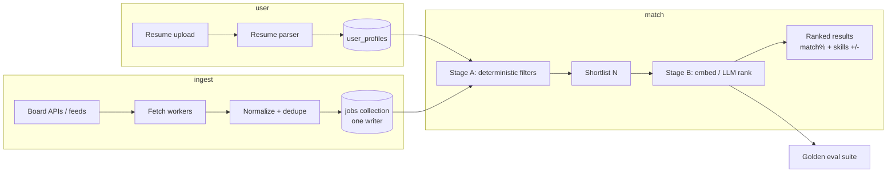

# SWARA contribution plan

Author: Ali Hamza Kamboh  
Role: candidate for Software Engineer  
Product reference: [swaraai.xyz](https://swaraai.xyz/)

This is not a rewrite of SWARA. It is the first 90 days of work I would own if I joined: what I would build, what I would refuse to build early, and how I would measure whether matching got better.

I write the plan before the agent implements. The PR has to match it.

## What I understand SWARA to be

From the public product:

- Upload resume once. Parse education, years, skills.
- Match against a shared job index refreshed across boards (Workable, Greenhouse, Remotive, We Work Remotely, Himalayas, RemoteOK, Lever, Arbeitnow, TheMuse, Adzuna, JSearch, and more).
- Rank roles with an AI engine. Show match %, matched skills, missing skills.
- Kill ghost jobs by preferring verified / recently posted roles (last 72 hours on the marketing site).
- Adjacent tools: ATS checker, resume builder, history, optional daily automation on Premium.

The hard product is not "call an LLM." The hard product is:

1. Fresh, deduped, attributable job inventory.
2. Resume parse that is stable across formats.
3. A score users can trust week to week.
4. Cost that does not explode when scan volume goes up.

## Locked decisions (what I would push for)

- **One writer for job documents.** Ingest workers normalize and write. Rankers and API readers never mutate inventory. Same class of bug as two writers on equity snapshots: duplicate truth, wrong rankings, silent corruption.
- **Ghost-job signal is first-class, not a filter bolted on.** Every listing carries `postedAt`, `lastSeenAt`, `source`, `sourceJobId`, `verifyStatus`. A role that disappears from its source within N hours is marked stale, not shown as live.
- **Matching is two stages.** Stage A is deterministic (skills, title family, years, remote/onsite, location). Stage B is LLM or embedding only on the shortlist. Do not score 12k listings with a full LLM pass per user.
- **Every score has an eval fixture.** Golden resume + golden job set. A release cannot ship if top-10 precision or skill-tag F1 drops past a threshold.
- **Parse once, store structured profile.** Re-runs read the profile, not the PDF, unless the user uploads a new file.
- **Cost budget per match run.** Cap Stage B calls. Log token spend per run. Cheap model for cheap work, escalate only on low confidence.

## Architecture I would target

### Data shapes (v1)

**jobs**

- `id` = hash of `source + sourceJobId` (stable across refreshes)
- `title`, `company`, `location`, `remote`, `url`
- `postedAt`, `lastSeenAt`, `verifyStatus` (`fresh` | `stale` | `gone`)
- `skills[]` (normalized), `rawText`, `embeddingRef` optional
- One writer path only. Upsert on refresh. Soft-delete when source returns gone.

**user_profiles**

- Parsed fields: `years`, `education`, `skills[]`, `titles[]`, `rawResumeHash`
- Version the parse schema. Re-parse only when schema or file changes.

**match_runs**

- `userId`, `createdAt`, `stageACount`, `stageBCount`, `tokenCost`, `topResults[]`
- Enough to debug "why did this role rank #1" without re-running the world.

## First 30 / 60 / 90 days

### Days 1 to 30: inventory truth

Goal: trust the job cache.

- Map every current source into one normalize schema.
- Dedupe by `source + sourceJobId`, then soft-dedupe near-duplicates by title+company+location window.
- Add `lastSeenAt` sweep: if a listing is missing from its source for X hours, mark `stale` / `gone`.
- Expose a simple admin or internal query: "how many fresh jobs by source today?"

Success metric: share of top-10 results that are still live 24 hours after shown. If that number is bad, matching polish is wasted.

### Days 31 to 60: matching that can be measured

Goal: stop shipping vibe scores.

- Split Stage A / Stage B as above.
- Skill ontology: map synonyms (`react.js` / `reactjs` / `react`) into one token before scoring.
- Missing-skills and matched-skills computed from Stage A tags, explained in the UI with the same ids the scorer used.
- Golden set of 20 to 50 resume/job pairs. CI runs the scorer on every PR that touches matching.

Success metric: offline precision@10 on golden set. Online: click-through and apply-intent on top 3 vs positions 8 to 10.

### Days 61 to 90: cost, speed, product loops

Goal: ~30s match stays true under load, Premium daily runs do not burn the budget.

- Cache Stage A results per profile hash + jobs snapshot version.
- Batch Stage B embeddings. Only re-embed jobs when raw text changes.
- Daily automation job: enqueue per Premium user, reuse shared job snapshot, write delta shortlist.
- ATS checker: treat as a separate deterministic scorer against a job description paste, not a second LLM product on day one.

Success metric: p95 match latency, $ per match run, and % of runs that finish without Stage B timeout.

## What I would not build in month one

- Custom fine-tuned model before golden evals exist.
- Scraping that ignores robots / ToS when an API or feed exists.
- Auto-apply bots that spam employers. Product trust dies first.
- A rewrite of the whole frontend while inventory quality is still soft.

## Judgment call I would make early

If Stage B LLM ranking is expensive and Stage A already separates noise from signal, I would ship Stage A + light embedding first and keep the LLM for explanation text ("why this matched") rather than for the sort key. Exciting model, wrong place. Users feel a bad sort. They forgive a shorter explanation.

## How I work (so you know what you get)

- Spec before implement. Agents and humans both follow the written plan.
- Production habits from AI fintech: single-writer boundaries, idempotent workers, replay when jobs die mid-run.
- LLM spend discipline: my own tooling cut token use from roughly 10B to 1 to 2B per month at the same shipping pace.
- Stack I ship daily: TypeScript, Python, React/Next, PostgreSQL or document stores, REST APIs, queue workers, GitHub Actions.

Related public work:

- Giveaway chat platform plan (single-writer bot, ticket flow): [plan-giveaway-chat](https://ahkamboh.github.io/ahkamboh/docs/plan-giveaway-chat.html)
- GitHub: [github.com/ahkamboh](https://github.com/ahkamboh)
- Cursor usage: [cursor.com/@ahkamboh](https://cursor.com/@ahkamboh)

## Offer

If useful, treat this doc as the start of the paid or unpaid trial. Pick one slice:

1. Ghost-job / freshness design for the shared cache, or
2. Stage A + Stage B split with a tiny golden eval harness, or
3. Resume parse → structured profile schema with versioning.

You set the deadline and the scope. I will ship working code and a short write-up of tradeoffs.

Remote from Lahore. US / EU / Americas overlap hours fine.

Ali Hamza Kamboh  
+92 317 6364957  
alihamzakamboh180@gmail.com  
https://linkedin.com/in/ahkamboh
